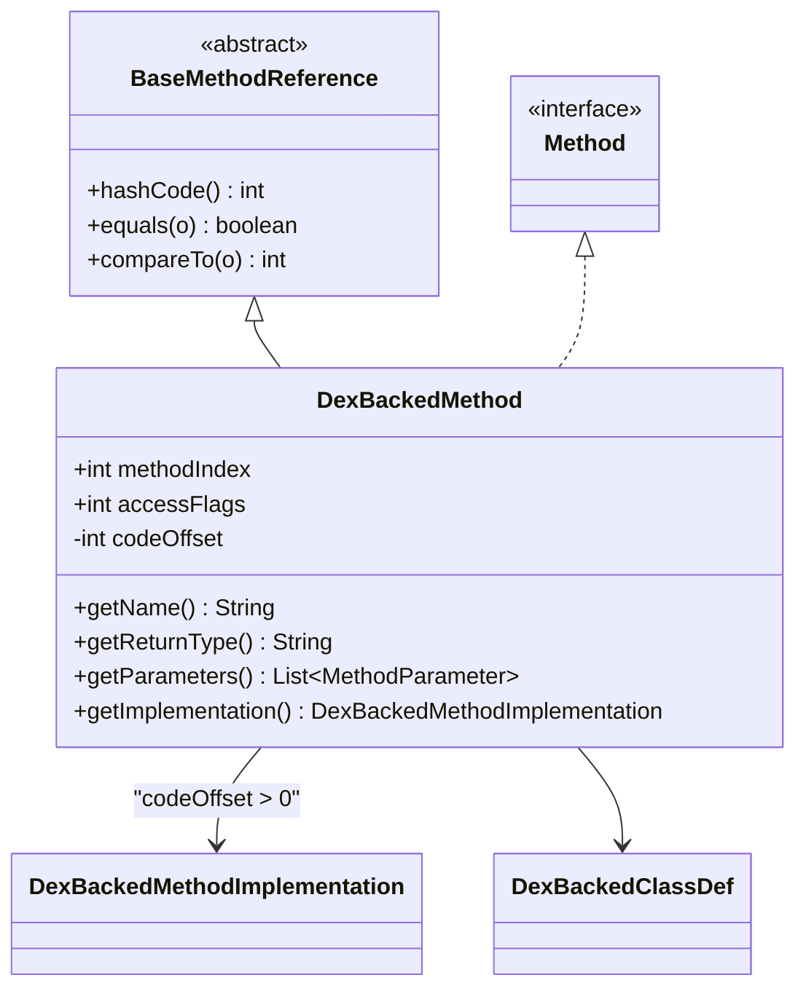

# 🔧 DexBackedMethod

从 DEX `encoded_method` 结构流式读取方法信息的实现类。

| 属性 | 值 |
|------|----|
| 包名 | `org.jf.dexlib2.dexbacked` |
| 类型 | `class extends BaseMethodReference implements Method` |
| 源码 | [DexBackedMethod.java](https://github.com/android-security-engineer/ZjDroid-skills/blob/master/src/org/jf/dexlib2/dexbacked/DexBackedMethod.java) |

## 🎯 职责

`DexBackedMethod` 对应 DEX `class_data_item` 中的 `encoded_method` 结构：

- 通过 method_index_diff 累加得到 `methodIndex`
- 读取 `accessFlags`（ULEB128）
- 读取 `codeOffset`（指向 `code_item` 的 ULEB128 偏移）
- 通过 `method_id_item` 查找方法名和原型（proto）
- 通过 `proto_id_item` 查找参数类型列表和返回类型

## 🧠 关键实现

### 两个构造函数

```java
// 简化构造（跳过注解迭代器，用于简单遍历）
public DexBackedMethod(DexReader reader, DexBackedClassDef classDef,
                       int previousMethodIndex) {
    this.dexFile = reader.dexBuf;
    this.classDef = classDef;

    int methodIndexDiff = reader.readLargeUleb128(); // 注意：用 readLargeUleb128
    this.methodIndex = methodIndexDiff + previousMethodIndex;
    this.accessFlags = reader.readSmallUleb128();
    this.codeOffset  = reader.readSmallUleb128();
    Logger.log("the codeoffset :" + this.codeOffset);

    this.methodAnnotationSetOffset = 0;
    this.parameterAnnotationSetListOffset = 0;
}

// 完整构造（带注解迭代器）
public DexBackedMethod(DexReader reader, DexBackedClassDef classDef,
                       int previousMethodIndex,
                       AnnotationIterator methodAnnotationIterator,
                       AnnotationIterator parameterAnnotationIterator) {
    // ... 同上，但额外查找注解偏移
    this.methodAnnotationSetOffset = methodAnnotationIterator.seekTo(methodIndex);
    this.parameterAnnotationSetListOffset = parameterAnnotationIterator.seekTo(methodIndex);
}
```

::: info method_index_diff 的累加语义
DEX 中 `encoded_method` 存储的是相对于**上一个方法** method index 的差值（差分编码）。构造时传入 `previousMethodIndex`，累加得到绝对索引。ZjDroid 注意到需要用 `readLargeUleb128` 而非 `readSmallUleb128`，因为 diff 值可能超过 2^31。
:::

### codeOffset 的重要性

```java
@Nullable
@Override
public DexBackedMethodImplementation getImplementation() {
    if (codeOffset > 0) {
        return new DexBackedMethodImplementation(dexFile, this, codeOffset);
    }
    return null;  // 抽象方法/接口方法
}
```

`codeOffset` 指向 `code_item` 结构（包含寄存器数、指令序列、try 块等），是方法体反汇编的入口。

### 方法名和原型的三级间接查找

```java
@Override
public String getName() {
    return dexFile.getString(
        dexFile.readSmallUint(getMethodIdItemOffset() + MethodIdItem.NAME_OFFSET)
    );
}

@Override
public String getReturnType() {
    return dexFile.getType(
        dexFile.readSmallUint(getProtoIdItemOffset() + ProtoIdItem.RETURN_TYPE_OFFSET)
    );
}
```

查找链：`methodIndex` → `method_id_item` → `proto_id_item` → type/string 表，在内存模式下每一级都通过 `MemoryReader` 读取。

### skipMethods 静态方法

```java
public static void skipMethods(DexReader reader, int count) {
    for (int i = 0; i < count; i++) {
        reader.skipUleb128();  // method_index_diff
        reader.skipUleb128();  // access_flags
        reader.skipUleb128();  // code_off
    }
}
```

用于跳过不需要解析的方法区块（如当只需遍历虚方法时跳过直接方法）。

## 🔗 关系



## 📌 小结

`DexBackedMethod` 是脱壳时**最频繁创建**的对象（每个方法一个实例）。它的惰性设计确保仅在真正需要时才进行 method_id/proto_id 查找，最小化内存模式下的 JNI 调用次数。

::: tip 关联阅读
- [MemoryBackSmali —— 调用 getImplementation() 的脱壳出口](/source/smali/MemoryBackSmali)
:::
