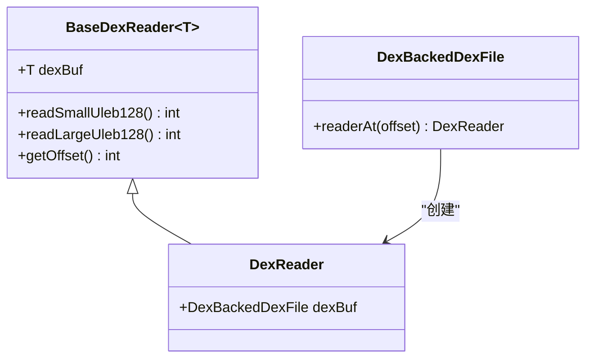

# 📜 DexReader

`BaseDexReader<DexBackedDexFile>` 的具名子类，dexbacked 层中所有解析操作的**标准读取器**。

| 属性 | 值 |
|------|----|
| 包名 | `org.jf.dexlib2.dexbacked` |
| 类型 | `class extends BaseDexReader<DexBackedDexFile>` |
| 源码 | [DexReader.java](https://github.com/android-security-engineer/ZjDroid-skills/blob/master/src/org/jf/dexlib2/dexbacked/DexReader.java) |

## 🎯 职责

`DexReader` 本身只有 4 行实现代码，是 Java 泛型系统的"**具名锚点**"：

```java
public class DexReader extends BaseDexReader<DexBackedDexFile> {
    public DexReader(@Nonnull DexBackedDexFile dexFile, int offset) {
        super(dexFile, offset);
    }
}
```

它将泛型参数 `T` 固定为 `DexBackedDexFile`，使上层代码（`DexBackedClassDef`、`DexBackedMethod` 等）可以直接声明 `DexReader` 类型，避免到处写 `BaseDexReader<DexBackedDexFile>`。

## 🧠 关键实现

### 创建方式

```java
// 通过 DexBackedDexFile 的工厂方法创建
@Override
public DexReader readerAt(int offset) {
    return new DexReader(this, offset);
}
```

### 在 DexBackedClassDef 中的典型使用

```java
// 从 class_data_item 起始处创建读取器，流式读取 4 个 ULEB128 计数
DexReader reader = dexFile.readerAt(classDataOffset);
staticFieldCount   = reader.readSmallUleb128();
instanceFieldCount = reader.readSmallUleb128();
directMethodCount  = reader.readSmallUleb128();
virtualMethodCount = reader.readSmallUleb128();
staticFieldsOffset = reader.getOffset(); // 记录字段数据起始位置
```

读取器游标每次调用 `readSmallUleb128()` 后自动前进，无需手动管理偏移。

::: info 与 BaseDexReader 的关系
`DexReader` 的所有实际能力来自 `BaseDexReader`：ULEB128/SLEB128 解析、字符串读取、各种整数格式读取等。`DexReader` 只是固定了泛型类型，本身不添加任何新方法。
:::

## 🔗 关系



## 📌 小结

`DexReader` 是 dexbacked 层"命名即文档"的体现。虽然只有 4 行代码，但它使整个 dexbacked 子包的代码更加清晰——每个持有 `DexReader` 字段的类，都明确表达了"我在解析一个 DEX 文件"的语义。
