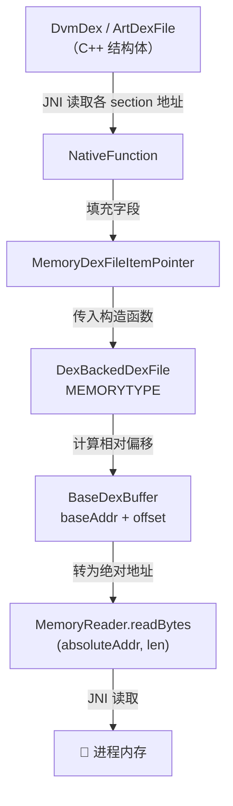

# 📍 MemoryDexFileItemPointer

ZjDroid 新增的**内存地址载体**，存储进程内存中 DEX 文件各 section 的绝对地址，是从内存布局到 dexlib2 解析的"桥梁"。

| 属性 | 值 |
|------|----|
| 包名 | `org.jf.dexlib2.dexbacked` |
| 类型 | `class`（ZjDroid 新增，POJO） |
| 源码 | [MemoryDexFileItemPointer.java](https://github.com/android-security-engineer/ZjDroid-skills/blob/master/src/org/jf/dexlib2/dexbacked/MemoryDexFileItemPointer.java) |
| 填充者 | `NativeFunction.getDexFileItemPointer()` |
| 消费者 | `DexBackedDexFile(MEMORYTYPE 构造函数)` |

## 🎯 职责

`MemoryDexFileItemPointer` 是一个纯 POJO（Plain Old Java Object），保存从 Native 层读取到的 DEX 内存布局信息：

- **`baseAddr`**：整个 DEX 在进程虚拟地址空间中的起始地址
- **`pStringIds`**：string_id_item 数组的绝对地址
- **`pTypeIds`**：type_id_item 数组的绝对地址
- **`pFieldIds`**：field_id_item 数组的绝对地址
- **`pMethodIds`**：method_id_item 数组的绝对地址
- **`pProtoIds`**：proto_id_item 数组的绝对地址
- **`pClassDefs`**：class_def_item 数组的绝对地址
- **`classCount`**：class_def_item 的数量（用于替代 header 中的计数）

## 🧠 关键实现

```java
public class MemoryDexFileItemPointer {
    private int baseAddr;
    private int pStringIds;
    private int pTypeIds;
    private int pFieldIds;
    private int pMethodIds;
    private int pProtoIds;
    private int pClassDefs;
    private int classCount;

    // setter/getter 省略 ...

    public String toString() {
        return "baseAddr:" + baseAddr
            + ";pStringIds:" + pStringIds
            + ";pTypeIds:" + pTypeIds
            + ";pFieldIds:" + pFieldIds
            + ";pMethodIds:" + pMethodIds
            + ";pProtoIds:" + pProtoIds
            + ";pClassDefs:" + pClassDefs;
    }
}
```

### 为什么需要这个类？

标准的 `DexBackedDexFile` 从文件字节数组中读取 DEX header（偏移 0~112 字节），从 header 中得到各 section 的偏移量。然而在**内存模式**下：

1. 进程内存中的 DEX 可能**没有标准 header**（加壳后已被抹去或修改）
2. 各 section 的**地址是绝对的**，而非相对于 DEX 基地址的偏移

因此 ZjDroid 绕过 header 解析，直接由 Native 层（通过 `DvmDex` 或 `ArtDexFile` 结构）读取各 section 指针，存入 `MemoryDexFileItemPointer`，再传给 `DexBackedDexFile`。

### DexBackedDexFile 中的使用方式

```java
// DexBackedDexFile.java —— MEMORYTYPE 构造函数
public DexBackedDexFile(Opcodes opcodes,
                        MemoryDexFileItemPointer pointer,
                        MemoryReader reader) {
    super(reader, pointer.getBaseAddr());   // 注入 MemoryReader + 基地址
    this.pointer = pointer;
    this.type = DexFileDataType.MEMORYTYPE;

    // 偏移 = 绝对地址 - 基地址（转为相对偏移供 BaseDexBuffer 使用）
    stringStartOffset = pointer.getpStringIds() - pointer.getBaseAddr();
    typeStartOffset   = pointer.getpTypeIds()   - pointer.getBaseAddr();
    protoStartOffset  = pointer.getpProtoIds()  - pointer.getBaseAddr();
    fieldStartOffset  = pointer.getpFieldIds()  - pointer.getBaseAddr();
    methodStartOffset = pointer.getpMethodIds() - pointer.getBaseAddr();
    classStartOffset  = pointer.getpClassDefs() - pointer.getBaseAddr();
    classCount        = pointer.getClassCount();  // 直接用 Native 读取的类数量
}
```

::: info 地址转换的巧妙之处
`pointer.getpXxx() - pointer.getBaseAddr()` 将绝对地址转换为**相对 DEX 基地址的偏移**。`BaseDexBuffer` 读取时再加回 `baseAddr`，最终变成绝对地址传给 `MemoryReader.readBytes()`，形成完整的地址还原循环。
:::

::: warning 越界检查被绕过
在 `MEMORYTYPE` 模式下，`getStringIdItemOffset()`、`getClassDefItemOffset()` 等方法均跳过了 `index < 0 || index >= count` 的合法性校验，直接计算地址。这是因为 classCount 来自 Native 层（可靠），而 stringCount/typeCount 等在内存模式下被设为 0（未知），不能用于校验。
:::

## 🔗 关系



## 📌 小结

`MemoryDexFileItemPointer` 是 ZjDroid 内存化改造的**数据枢纽**：它将 Android Runtime 内部的 C++ DEX 结构信息"翻译"成 Java 层可用的绝对地址，是打通 Native 与 dexlib2 的关键数据传递对象。

没有这个类，dexlib2 无法知道在哪个内存地址开始解析各个 DEX section，脱壳落地便无法实现。

::: tip 延伸阅读
- [MemoryReader —— 读取内存的接口](./MemoryReader)
- [DexBackedDexFile —— 消费 Pointer 的入口](./DexBackedDexFile)
- [NativeFunction —— 填充 Pointer 的 Native 实现](/source/util/NativeFunction)
:::
