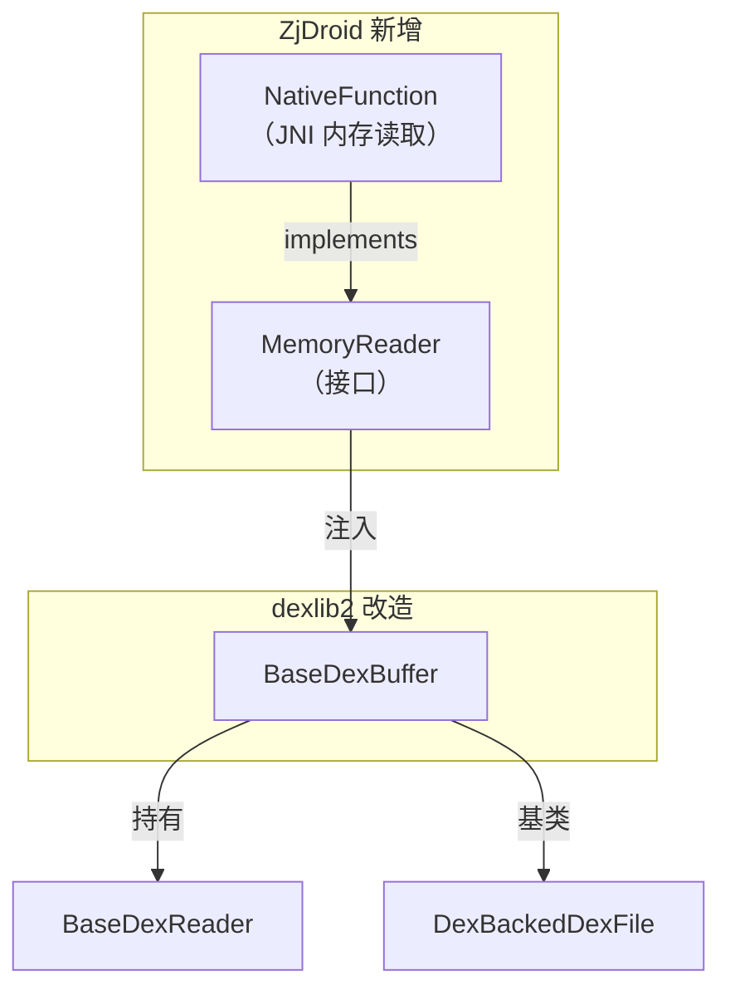

# 🧠 MemoryReader

ZjDroid 新增的**内存读取抽象接口**，将 dexlib2 的数据源从文件字节数组扩展到任意进程内存地址。

| 属性 | 值 |
|------|----|
| 包名 | `org.jf.dexlib2.dexbacked` |
| 类型 | `interface`（ZjDroid 新增） |
| 源码 | [MemoryReader.java](https://github.com/android-security-engineer/ZjDroid-skills/blob/master/src/org/jf/dexlib2/dexbacked/MemoryReader.java) |
| 实现类 | `com.android.reverse.util.NativeFunction`（通过 JNI 读取进程内存） |

## 🎯 职责

`MemoryReader` 是 ZjDroid 内存化改造的**核心抽象**：用一个极简的接口隔离"从哪里读"和"读出来的数据怎么用"，使 dexlib2 的整个解析体系无需改动即可应用于进程内存场景。

## 🧠 关键实现

```java
package org.jf.dexlib2.dexbacked;

public interface MemoryReader {
    /**
     * 从绝对内存地址 start 处读取 length 个字节。
     *
     * @param start  进程内存的绝对地址（非 DEX 相对偏移）
     * @param length 要读取的字节数
     * @return       长度为 length 的字节数组
     */
    public byte[] readBytes(int start, int length);
}
```

::: warning 注意：参数名拼写错误
源码中第二个参数名为 `lenght`（原文拼写错误），这是 ZjDroid 原始代码的一部分，功能不受影响。
:::

### 接口设计的精妙之处

这个接口只有**一个方法**，极度简洁：

1. 接收**绝对内存地址**（`start`），而非相对于某个基地址的偏移
2. 调用者决定读取长度，接口不关心缓存或分页
3. 实现者（`NativeFunction`）通过 JNI 调用 `ptrace` 或 `/proc/pid/mem` 完成实际的内存读取

### 在 BaseDexBuffer 中的集成

```java
// BaseDexBuffer.java（ZjDroid 改造后）
public class BaseDexBuffer {
    final byte[] buf;          // 文件模式：字节数组
    private MemoryReader reader; // 内存模式：内存读取器
    private int baseAddr;        // 内存模式：DEX 在进程中的基地址

    public int readSmallUint(int offset) {
        if (this.reader == null) {
            // 文件模式：直接读 byte[] buf
            byte[] buf = this.buf;
            int result = (buf[offset] & 0xff) | ...;
            return result;
        } else {
            // 内存模式：调用 MemoryReader，地址 = baseAddr + offset
            byte[] buf = this.reader.readBytes(this.baseAddr + offset, 4);
            int result = (buf[0] & 0xff) | ...;
            return result;
        }
    }
}
```

每个读取方法都有**两条代码路径**：`reader == null` 走文件模式，否则走内存模式。`MemoryReader` 的引入使这一分支完全透明于上层解析逻辑。

## 🔗 关系



## 📌 小结

`MemoryReader` 是一个"**四两拨千斤**"式的设计：仅一个方法、7 行代码，却撬动了整个 dexlib2 的工作模式从"读文件"切换到"读进程内存"。这正是面向接口编程在逆向工程工具中的典型价值体现。

::: tip 延伸阅读
`NativeFunction` 是 `MemoryReader` 的唯一实现，通过 JNI 向 C/C++ 层调用来完成真实内存读取。详见 [NativeFunction 精讲](/source/util/NativeFunction)。
:::
