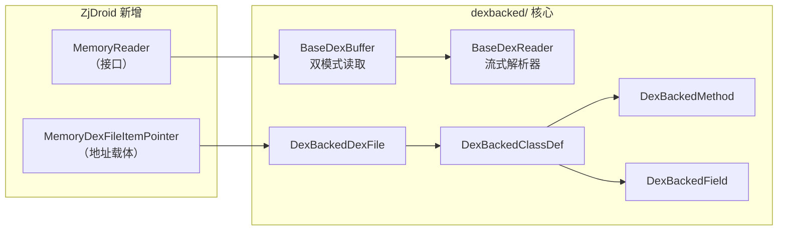

# ⚡ dexbacked —— 高性能 DEX 读取实现

`org.jf.dexlib2.dexbacked` 是 dexlib2 的**核心实现层**，提供了基于原始字节数据的高效 DEX 解析能力。ZjDroid 在此基础上新增了两个关键类，将数据源从文件扩展到**进程内存**，从而实现脱壳。

::: warning ZjDroid 核心改造区域
本子包是 ZjDroid 唯一对 dexlib2 源码进行改造的位置：
- **新增 `MemoryReader` 接口**：抽象内存读取能力
- **新增 `MemoryDexFileItemPointer` 类**：携带进程内存中 DEX section 的绝对地址
- **改造 `BaseDexBuffer`**：支持 `MemoryReader` 双模式（文件/内存）
- **改造 `DexBackedDexFile`**：新增 `MEMORYTYPE` 构造路径，绕过 magic 校验和越界检查
:::

## 📍 在 DEX 读取流水线中的位置

## 📋 关键类清单

| 类/接口 | 源码 | 职责 |
|---------|------|------|
| [MemoryReader ⭐](./MemoryReader) | [源码](https://github.com/android-security-engineer/ZjDroid-skills/blob/master/src/org/jf/dexlib2/dexbacked/MemoryReader.java) | ZjDroid 新增：内存读取接口契约 |
| [MemoryDexFileItemPointer ⭐](./MemoryDexFileItemPointer) | [源码](https://github.com/android-security-engineer/ZjDroid-skills/blob/master/src/org/jf/dexlib2/dexbacked/MemoryDexFileItemPointer.java) | ZjDroid 新增：进程内存中各 section 指针 |
| [BaseDexBuffer](./BaseDexBuffer) | [源码](https://github.com/android-security-engineer/ZjDroid-skills/blob/master/src/org/jf/dexlib2/dexbacked/BaseDexBuffer.java) | 低级字节读取，支持文件/内存双源 |
| [BaseDexReader](./BaseDexReader) | [源码](https://github.com/android-security-engineer/ZjDroid-skills/blob/master/src/org/jf/dexlib2/dexbacked/BaseDexReader.java) | 有状态流式读取器，解析 ULEB128/SLEB128 等编码 |
| [DexReader](./DexReader) | [源码](https://github.com/android-security-engineer/ZjDroid-skills/blob/master/src/org/jf/dexlib2/dexbacked/DexReader.java) | `BaseDexReader<DexBackedDexFile>` 的具名子类 |
| [DexBackedDexFile](./DexBackedDexFile) | [源码](https://github.com/android-security-engineer/ZjDroid-skills/blob/master/src/org/jf/dexlib2/dexbacked/DexBackedDexFile.java) | DEX 文件/内存的顶层解析入口，含 MEMORYTYPE 模式 |
| [DexBackedClassDef](./DexBackedClassDef) | [源码](https://github.com/android-security-engineer/ZjDroid-skills/blob/master/src/org/jf/dexlib2/dexbacked/DexBackedClassDef.java) | 懒加载类定义，含 isValid 容错机制 |
| [DexBackedMethod](./DexBackedMethod) | [源码](https://github.com/android-security-engineer/ZjDroid-skills/blob/master/src/org/jf/dexlib2/dexbacked/DexBackedMethod.java) | 从 class_data_item 流式读取方法信息 |

## 🔗 相关文档

- [MemoryReader 精讲](./MemoryReader)（ZjDroid 核心改造 #1）
- [MemoryDexFileItemPointer 精讲](./MemoryDexFileItemPointer)（ZjDroid 核心改造 #2）
- [NativeFunction —— MemoryReader 的底层实现](/source/util/NativeFunction)
- [整体脱壳流水线](/architecture/unpacking-pipeline)
