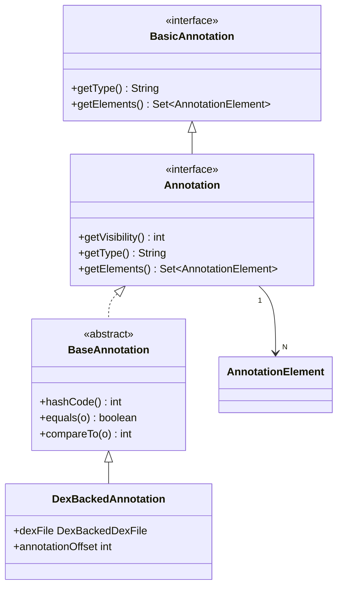

# 🏷️ Annotation

表示应用于类/字段/方法/参数的单个注解实例。

| 属性 | 值 |
|------|----|
| 包名 | `org.jf.dexlib2.iface` |
| 类型 | `interface extends BasicAnnotation, Comparable<Annotation>` |
| 源码 | [Annotation.java](https://github.com/android-security-engineer/ZjDroid-skills/blob/master/src/org/jf/dexlib2/iface/Annotation.java) |
| 实现类 | `DexBackedAnnotation` |

## 🎯 职责

描述 DEX `annotation_item` 的三要素：

- **可见性**（`getVisibility()`）：对应 `AnnotationVisibility.BUILD / RUNTIME / SYSTEM`
- **类型**（`getType()`）：注解类的类型描述符
- **元素集合**（`getElements()`）：`name=value` 键值对的 `Set<AnnotationElement>`

## 🧠 关键实现

```java
public interface Annotation extends BasicAnnotation, Comparable<Annotation> {
    int getVisibility();         // AnnotationVisibility.BUILD/RUNTIME/SYSTEM
    @Nonnull String getType();   // 如 "Ljava/lang/Deprecated;"
    @Nonnull Set<? extends AnnotationElement> getElements();

    @Override int hashCode();    // visibility + type + elements 三者哈希
    @Override boolean equals(@Nullable Object o);
    @Override int compareTo(Annotation o);
}
```

::: tip 抽象基类减少重复
`BaseAnnotation`（base/ 子包）提供了 `hashCode`、`equals`、`compareTo` 的标准实现，所有具体注解类（如 `DexBackedAnnotation`）只需继承基类，无需自行实现三个方法。
:::

## 🔗 关系



## 📌 小结

注解在 DEX 中广泛用于框架元数据（如 `@Override`、`@Nullable`）和 Dex 优化标记。脱壳时还原注解信息可以使 smali 文件在语义上更完整，便于后续逆向分析。
