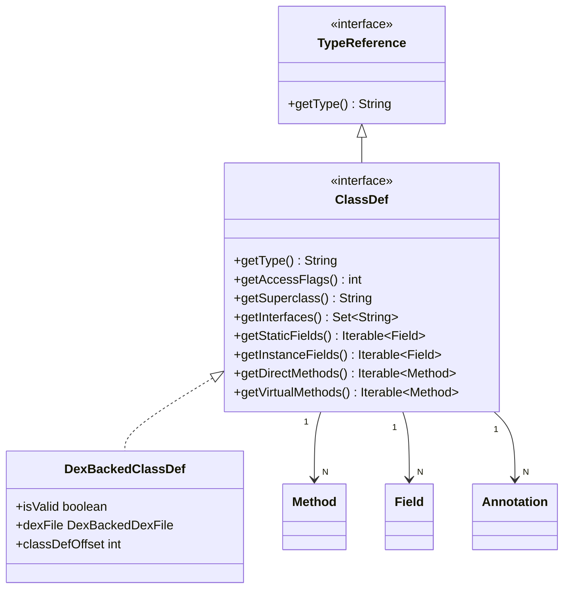

# 🏛️ ClassDef

DEX 类定义的**核心接口**，承载一个 Java/Dalvik 类的全部元信息。

| 属性 | 值 |
|------|----|
| 包名 | `org.jf.dexlib2.iface` |
| 类型 | `interface extends TypeReference` |
| 源码 | [ClassDef.java](https://github.com/android-security-engineer/ZjDroid-skills/blob/master/src/org/jf/dexlib2/iface/ClassDef.java) |
| 实现类 | `DexBackedClassDef`、`ImmutableClassDef` |

## 🎯 职责

`ClassDef` 定义了从一个类结构中能够获取的**所有信息**：

- 类型描述符（`Ljava/lang/String;` 格式）
- 访问标志（public/abstract/interface 等）
- 父类型与实现接口列表
- 源文件名
- 注解集合
- 静态字段、实例字段
- 直接方法（direct）、虚方法（virtual）

## 🧠 关键实现

```java
public interface ClassDef extends TypeReference {
    @Override @Nonnull String getType();          // Ljava/xxx/ClassName;
    int getAccessFlags();
    @Nullable String getSuperclass();
    @Nonnull Set<String> getInterfaces();
    @Nullable String getSourceFile();
    @Nonnull Set<? extends Annotation> getAnnotations();
    @Nonnull Iterable<? extends Field> getStaticFields();
    @Nonnull Iterable<? extends Field> getInstanceFields();
    @Nonnull Iterable<? extends Field> getFields();          // 合并便捷方法
    @Nonnull Iterable<? extends Method> getDirectMethods();
    @Nonnull Iterable<? extends Method> getVirtualMethods();
    @Nonnull Iterable<? extends Method> getMethods();        // 合并便捷方法
}
```

::: info ClassDef 同时也是 TypeReference
接口继承了 `TypeReference`，因此 `ClassDef` 本身就可以作为类型引用（例如用于 `new-instance` 指令的操作数），实现了"自我描述"的设计。
:::

**ZjDroid 脱壳路径中的角色：**

```
DexBackedDexFile.getClasses()
  └─► DexBackedClassDef（ClassDef 实现）
        ├─ getType()          → smali 文件名
        ├─ getMethods()       → 遍历方法体，反汇编指令
        └─ getFields()        → 输出字段声明
```

## 🔗 关系



## 📌 小结

`ClassDef` 是脱壳流程中遍历量最大的接口。ZjDroid 的 `DexBackedClassDef` 实现在读取类数据时增加了 `isValid` 保护标志，对加壳应用中损坏的类结构进行了容错处理，这是原版 smali 所没有的改动。
