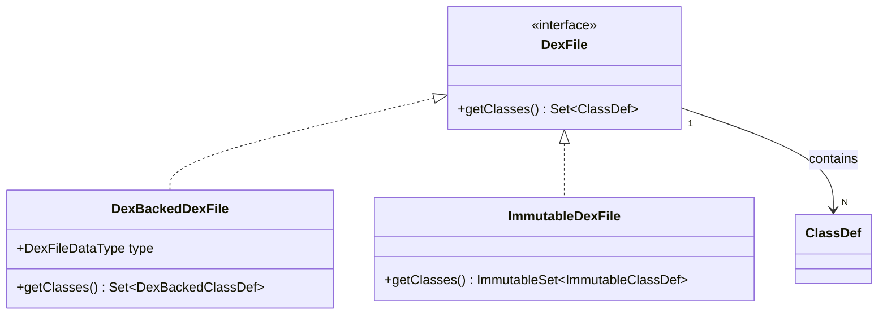

# 📄 DexFile

DEX 文件的**根接口**，整个 dexlib2 对象模型的入口点。

| 属性 | 值 |
|------|----|
| 包名 | `org.jf.dexlib2.iface` |
| 类型 | `interface` |
| 源码 | [DexFile.java](https://github.com/android-security-engineer/ZjDroid-skills/blob/master/src/org/jf/dexlib2/iface/DexFile.java) |
| 实现类 | `DexBackedDexFile`、`ImmutableDexFile` |

## 🎯 职责

`DexFile` 的职责极为单纯：**暴露 DEX 中所有类定义的集合**。它是消费者与底层存储（文件字节/进程内存）之间的解耦边界。

## 🧠 关键实现

```java
public interface DexFile {
    /**
     * 获取该 DEX 中所有类定义的集合，类型唯一。
     */
    @Nonnull Set<? extends ClassDef> getClasses();
}
```

::: tip 为什么返回 Set 而不是 List？
DEX 规范要求每个类型描述符在一个 DEX 文件中唯一，因此接口用 `Set` 语义传达这一约束。底层的 `DexBackedDexFile` 通过 `FixedSizeSet` 实现惰性迭代，避免一次性将所有类解析到内存。
:::

**ZjDroid 如何使用：** `MemoryBackSmali.backSmali()` 调用 `dexFile.getClasses()` 遍历内存中解密后的全部类，逐一反汇编输出 smali 文件，完成整体脱壳落地。

## 🔗 关系



## 📌 小结

`DexFile` 是 dexlib2 接口层的**顶层契约**，一行代码定义了所有 DEX 操作的起点。ZjDroid 通过 `DexBackedDexFile(MEMORYTYPE)` 实现让这个接口"指向"的数据从进程内存而非磁盘文件读取，实现了非侵入式的脱壳适配。
