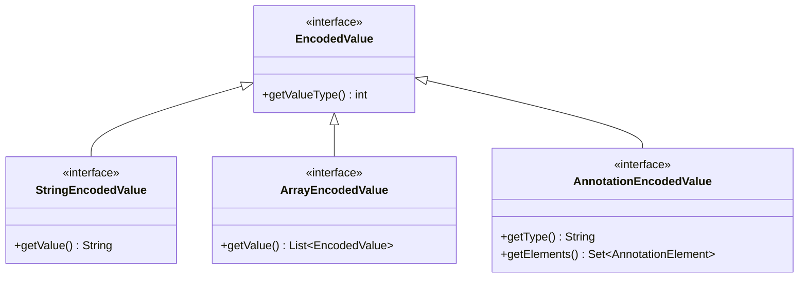

# 🔢 EncodedValue

DEX 编码值的**根接口**，用于表示字段初始值和注解参数值。

| 属性 | 值 |
|------|----|
| 包名 | `org.jf.dexlib2.iface.value` |
| 类型 | `interface extends Comparable<EncodedValue>` |
| 源码 | [EncodedValue.java](https://github.com/android-security-engineer/ZjDroid-skills/blob/master/src/org/jf/dexlib2/iface/value/EncodedValue.java) |

## 🎯 职责

`EncodedValue` 是一个类型分发接口，通过 `getValueType()` 返回具体类型常量（对应 `ValueType.*`），消费者再将其强转为具体子接口。

## 🧠 关键实现

```java
public interface EncodedValue extends Comparable<EncodedValue> {
    /**
     * 返回值类型，对应 ValueType.* 常量：
     * VALUE_BYTE, VALUE_SHORT, VALUE_CHAR, VALUE_INT, VALUE_LONG,
     * VALUE_FLOAT, VALUE_DOUBLE, VALUE_STRING, VALUE_TYPE,
     * VALUE_FIELD, VALUE_METHOD, VALUE_ENUM,
     * VALUE_ARRAY, VALUE_ANNOTATION, VALUE_NULL, VALUE_BOOLEAN
     */
    int getValueType();
}
```

### 子接口体系

| 子接口 | `ValueType` 常量 | 用途 |
|--------|-----------------|------|
| `ByteEncodedValue` | `VALUE_BYTE` | byte 字面量 |
| `IntEncodedValue` | `VALUE_INT` | int 字面量 |
| `LongEncodedValue` | `VALUE_LONG` | long 字面量 |
| `StringEncodedValue` | `VALUE_STRING` | 字符串引用 |
| `TypeEncodedValue` | `VALUE_TYPE` | 类型描述符 |
| `FieldEncodedValue` | `VALUE_FIELD` | 字段引用 |
| `MethodEncodedValue` | `VALUE_METHOD` | 方法引用 |
| `EnumEncodedValue` | `VALUE_ENUM` | 枚举值 |
| `ArrayEncodedValue` | `VALUE_ARRAY` | 嵌套数组 |
| `AnnotationEncodedValue` | `VALUE_ANNOTATION` | 嵌套注解 |
| `NullEncodedValue` | `VALUE_NULL` | null 值 |
| `BooleanEncodedValue` | `VALUE_BOOLEAN` | boolean 字面量 |

## 🔗 关系



## 📌 小结

`EncodedValue` 体系覆盖了 DEX 中所有可以出现在"静态数据区"的值类型，是 dexlib2 类型系统最为完整的一个子包。在脱壳 smali 输出中，字段的 `.value` 指令和注解的元素值都依赖这套接口。
