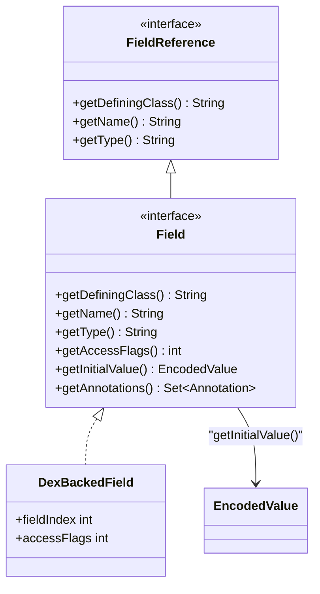

# 🗄️ Field

DEX 字段定义的接口，同时也是该字段的**自引用 FieldReference**。

| 属性 | 值 |
|------|----|
| 包名 | `org.jf.dexlib2.iface` |
| 类型 | `interface extends FieldReference` |
| 源码 | [Field.java](https://github.com/android-security-engineer/ZjDroid-skills/blob/master/src/org/jf/dexlib2/iface/Field.java) |
| 实现类 | `DexBackedField` |

## 🎯 职责

描述类中的一个字段，包括：

- 所属类类型、字段名、字段类型
- 访问标志（`public static final` 等）
- 静态字段的初始值（`EncodedValue`，仅 static 字段可能有）
- 字段上的注解集合

## 🧠 关键实现

```java
public interface Field extends FieldReference {
    @Nonnull String getDefiningClass();
    @Nonnull String getName();
    @Nonnull String getType();
    int getAccessFlags();

    /**
     * 仅 static 字段可能有初始值；实例字段和无初始值的静态字段返回 null。
     */
    @Nullable EncodedValue getInitialValue();

    @Nonnull Set<? extends Annotation> getAnnotations();
}
```

::: info 字段初始值与 static_values_item
DEX 格式中，静态字段的初始值以 `encoded_array_item` 格式存储在 class_def_item 的 `static_values` 偏移处，按字段定义顺序一一对应。`DexBackedField` 使用 `StaticInitialValueIterator` 来惰性读取这些初始值。
:::

## 🔗 关系



## 📌 小结

`Field` 接口使 ZjDroid 能够在脱壳输出的 smali 文件中还原完整的字段声明，包括访问修饰符和静态字段的初始值，这对于后续正确重新编译 smali 至关重要。
