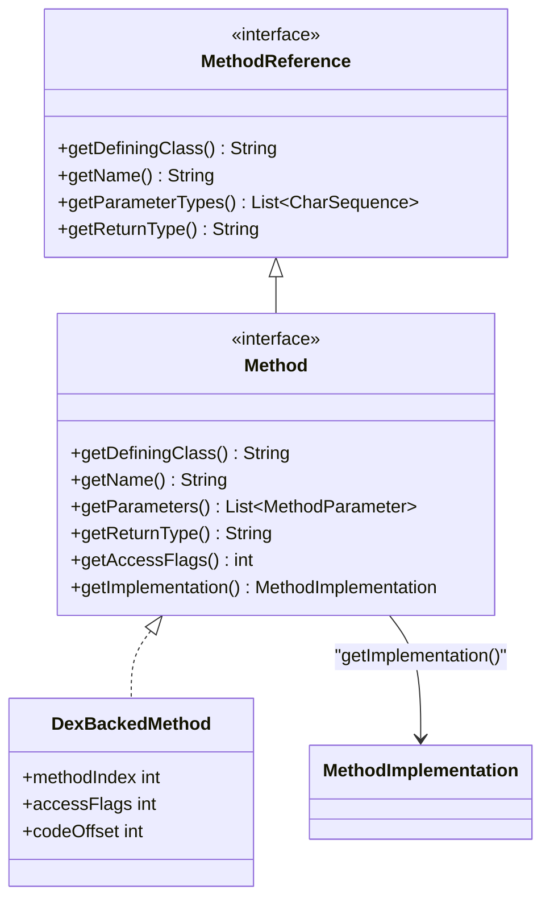

# ⚙️ Method

表示 DEX 中单个方法定义的接口，同时也是该方法的**自引用 MethodReference**。

| 属性 | 值 |
|------|----|
| 包名 | `org.jf.dexlib2.iface` |
| 类型 | `interface extends MethodReference` |
| 源码 | [Method.java](https://github.com/android-security-engineer/ZjDroid-skills/blob/master/src/org/jf/dexlib2/iface/Method.java) |
| 实现类 | `DexBackedMethod` |

## 🎯 职责

`Method` 接口描述一个方法的完整签名和实现：

- 所属类类型（`getDefiningClass()`）
- 方法名和参数类型列表（作为 `MethodReference`）
- 返回类型和访问标志
- 注解集合
- 方法体（`getImplementation()`，`null` 表示抽象/接口方法）

## 🧠 关键实现

```java
public interface Method extends MethodReference {
    @Override @Nonnull String getDefiningClass();
    @Override @Nonnull String getName();
    @Nonnull List<? extends MethodParameter> getParameters();
    @Override @Nonnull String getReturnType();
    int getAccessFlags();
    @Nonnull Set<? extends Annotation> getAnnotations();

    /**
     * 返回方法实现体；抽象方法或接口方法返回 null。
     */
    @Nullable MethodImplementation getImplementation();
}
```

::: tip getImplementation() 是脱壳关键入口
`MemoryBackSmali` 在遍历方法时，通过 `method.getImplementation()` 获取 `DexBackedMethodImplementation`，进而取得方法指令列表，完成 Smali 反汇编。若返回 `null`（抽象方法），则直接输出方法签名而不输出方法体。
:::

## 🔗 关系



## 📌 小结

`Method` 的双重身份（方法定义 + 方法引用）让其既能作为类成员遍历，也能作为 `invoke-*` 指令中的操作数引用，是 dexlib2 接口设计中最体现"统一模型"的体现。
