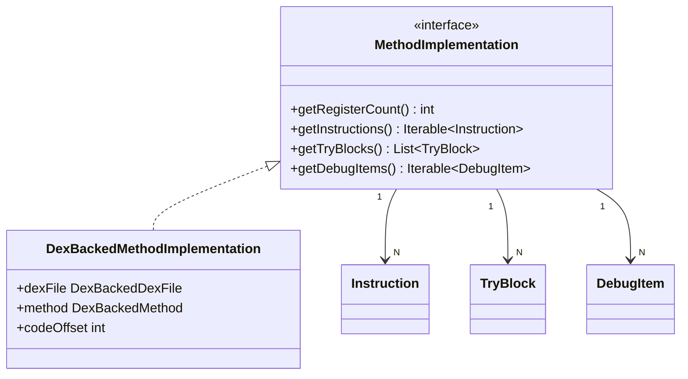

# 🔧 MethodImplementation

描述方法**具体实现细节**的接口：指令序列、try/catch 块和调试信息。

| 属性 | 值 |
|------|----|
| 包名 | `org.jf.dexlib2.iface` |
| 类型 | `interface` |
| 源码 | [MethodImplementation.java](https://github.com/android-security-engineer/ZjDroid-skills/blob/master/src/org/jf/dexlib2/iface/MethodImplementation.java) |
| 实现类 | `DexBackedMethodImplementation`、`ImmutableMethodImplementation` |

## 🎯 职责

`MethodImplementation` 对应 DEX 格式中的 `code_item` 结构，包含：

1. **寄存器数量**（`getRegisterCount()`）
2. **指令列表**（`getInstructions()`）—— Dalvik 字节码序列
3. **try 块列表**（`getTryBlocks()`）—— 异常处理范围
4. **调试信息**（`getDebugItems()`）—— 行号、局部变量等

## 🧠 关键实现

```java
public interface MethodImplementation {
    int getRegisterCount();

    @Nonnull Iterable<? extends Instruction> getInstructions();

    @Nonnull List<? extends TryBlock<? extends ExceptionHandler>> getTryBlocks();

    @Nonnull Iterable<? extends DebugItem> getDebugItems();
}
```

::: info try/catch 语义放宽
接口规范允许 try 块自由重叠，无需像 DEX 格式要求的那样严格排序——写入器会在输出时自动归一化。这给了 ZjDroid 更大的容错空间处理加壳后不规范的 DEX。
:::

**ZjDroid 中的关键路径：**

`MemoryBackSmali` 通过 `getImplementation().getInstructions()` 拿到全部指令，逐条调用 smali 格式化器输出 `.smali` 文件，这是脱壳产物的核心内容。

## 🔗 关系



## 📌 小结

`MethodImplementation` 是整个 DEX 数据中**体量最大**的部分（code_item 包含实际字节码）。ZjDroid 能从进程内存直接惰性读取每条指令，无需一次性加载全部字节码，这得益于 dexbacked 实现的流式设计。
