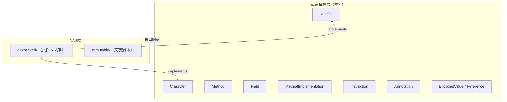

# 🎭 iface —— DEX 抽象对象模型

`org.jf.dexlib2.iface` 包是 dexlib2 的**纯抽象层**，定义了描述一个 DEX 文件所需的全部 Java 接口。它不关心数据来自文件还是内存，只规定"一个 DEX 应该长什么样"。

::: info 设计哲学
所有接口均由上层消费者（如 smali 反汇编器、DEX 写入器）编程，底层实现（dexbacked/、immutable/ 等）面向接口提供数据。ZjDroid 的脱壳路径完全依赖这套接口与 dexbacked/ 实现交互。
:::

## 📍 在 DEX 读取流水线中的位置

## 📋 关键接口清单

| 接口 | 文件 | 职责简述 |
|------|------|---------|
| [DexFile](./DexFile) | `DexFile.java` | DEX 文件根接口，提供 `getClasses()` |
| [ClassDef](./ClassDef) | `ClassDef.java` | 类定义：类型、父类、接口、字段、方法 |
| [Method](./Method) | `Method.java` | 方法定义 + `MethodReference` |
| [Field](./Field) | `Field.java` | 字段定义 + `FieldReference` |
| [MethodImplementation](./MethodImplementation) | `MethodImplementation.java` | 方法体：指令、try/catch、调试信息 |
| [Instruction](./Instruction) | `instruction/Instruction.java` | 单条 Dalvik 指令抽象 |
| [Annotation](./Annotation) | `Annotation.java` | 注解：可见性、类型、元素 |
| [EncodedValue](./EncodedValue) | `value/EncodedValue.java` | 编码值（字段初始值、注解参数）基接口 |

## 🔗 相关文档

- [dexbacked/ 实现层](../dexbacked/)
- [base/ 抽象基类](../base/)
- [MemoryBackSmali —— 消费接口的脱壳出口](/source/smali/MemoryBackSmali)
