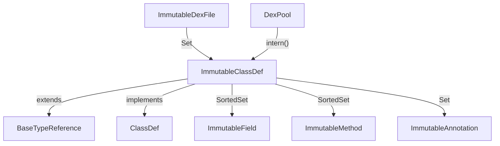

# 🏛️ ImmutableClassDef

`ImmutableClassDef` 是 `iface.ClassDef` 接口的不可变内存实现，将一个完整的 Dalvik 类（类型、继承关系、字段、方法、注解）封装为线程安全的值对象。

| 属性 | 值 |
|---|---|
| 源码 | [immutable/ImmutableClassDef.java](https://github.com/android-security-engineer/ZjDroid-skills/blob/master/src/org/jf/dexlib2/immutable/ImmutableClassDef.java) |
| 包名 | `org.jf.dexlib2.immutable` |
| 继承 | `extends BaseTypeReference implements ClassDef` |

## 🎯 职责

1. 不可变存储类的全部元数据：类型描述符、access flags、父类、接口列表、源文件名
2. 持有静态字段、实例字段（`ImmutableSortedSet`，按字段定义排序）
3. 持有直接方法、虚方法（`ImmutableSortedSet`，按方法定义排序）
4. 持有注解集合

## 🧠 关键实现

### 字段定义

```java
public class ImmutableClassDef extends BaseTypeReference implements ClassDef {
    @Nonnull protected final String type;
    protected final int accessFlags;
    @Nullable protected final String superclass;
    @Nonnull protected final ImmutableSet<String> interfaces;
    @Nullable protected final String sourceFile;
    @Nonnull protected final ImmutableSet<? extends ImmutableAnnotation> annotations;
    @Nonnull protected final ImmutableSortedSet<? extends ImmutableField> staticFields;
    @Nonnull protected final ImmutableSortedSet<? extends ImmutableField> instanceFields;
    @Nonnull protected final ImmutableSortedSet<? extends ImmutableMethod> directMethods;
    @Nonnull protected final ImmutableSortedSet<? extends ImmutableMethod> virtualMethods;
```

### 构造函数

```java
public ImmutableClassDef(@Nonnull String type,
                         int accessFlags,
                         @Nullable String superclass,
                         @Nullable Collection<String> interfaces,
                         @Nullable String sourceFile,
                         @Nullable Collection<? extends Annotation> annotations,
                         @Nullable Iterable<? extends Field> fields,
                         @Nullable Iterable<? extends Method> methods) {
    if (fields == null) fields = ImmutableList.of();
    if (methods == null) methods = ImmutableList.of();
    this.type = type;
    this.accessFlags = accessFlags;
    this.superclass = superclass;
    this.interfaces = interfaces == null ? ImmutableSet.<String>of()
                                         : ImmutableSet.copyOf(interfaces);
    this.sourceFile = sourceFile;
    this.annotations = annotations == null ? ImmutableSet.<ImmutableAnnotation>of()
                                           : ImmutableAnnotation.immutableSetOf(annotations);
    // fields 分流为 static 和 instance，methods 分流为 direct 和 virtual
    Iterable<? extends Field> staticFields = Iterables.filter(fields, FieldUtil.FIELD_IS_STATIC);
    Iterable<? extends Field> instanceFields = Iterables.filter(fields, FieldUtil.FIELD_IS_INSTANCE);
    this.staticFields = ImmutableSortedSet.copyOf(ImmutableField.immutableListOf(staticFields));
    this.instanceFields = ImmutableSortedSet.copyOf(ImmutableField.immutableListOf(instanceFields));
    ...
}
```

### getType — 实现 TypeReference

```java
@Nonnull @Override public String getType() { return type; }
```

`ImmutableClassDef` 通过继承 `BaseTypeReference` 同时实现了 `TypeReference`，可以在需要类型引用的地方直接传入。

## 🔗 关系



## 📌 小结

`ImmutableClassDef` 是 ZjDroid 脱壳产出的核心数据结构。脱壳完成后，内存中重建的每个类都表示为 `ImmutableClassDef` 对象，批量注册到 `DexPool` 后写出为合法 DEX 文件。其 `ImmutableSortedSet` 的排序特性确保了写出的 DEX 满足规范对字段/方法顺序的要求。
