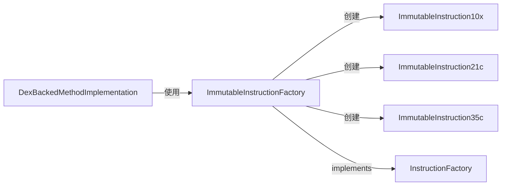

# 🏭 ImmutableInstructionFactory

`ImmutableInstructionFactory` 是 `InstructionFactory<Reference>` 的不可变实现，提供所有 Dalvik 指令格式的工厂方法，是 dexbacked 层从字节流反序列化指令时使用的**全局单例工厂**。

| 属性 | 值 |
|---|---|
| 源码 | [immutable/instruction/ImmutableInstructionFactory.java](https://github.com/android-security-engineer/ZjDroid-skills/blob/master/src/org/jf/dexlib2/immutable/instruction/ImmutableInstructionFactory.java) |
| 包名 | `org.jf.dexlib2.immutable.instruction` |
| 实现接口 | `InstructionFactory<Reference>` |
| 单例 | `ImmutableInstructionFactory.INSTANCE` |

## 🎯 职责

为每种 Dalvik 指令格式提供 `makeInstructionXxx(opcode, ...)` 工厂方法，dexbacked 层的字节码解析器调用这些方法将原始字节转换为 `ImmutableInstruction` 对象。

## 🧠 关键实现

```java
public class ImmutableInstructionFactory implements InstructionFactory<Reference> {
    public static final ImmutableInstructionFactory INSTANCE = new ImmutableInstructionFactory();

    private ImmutableInstructionFactory() {}  // 单例

    public ImmutableInstruction10x makeInstruction10x(@Nonnull Opcode opcode) {
        return new ImmutableInstruction10x(opcode);
    }

    public ImmutableInstruction21c makeInstruction21c(@Nonnull Opcode opcode,
                                                       int registerA,
                                                       @Nonnull Reference reference) {
        return new ImmutableInstruction21c(opcode, registerA, reference);
    }

    public ImmutableInstruction35c makeInstruction35c(@Nonnull Opcode opcode,
                                                       int registerCount,
                                                       int registerC, int registerD,
                                                       int registerE, int registerF,
                                                       int registerG,
                                                       @Nonnull Reference reference) {
        return new ImmutableInstruction35c(opcode, registerCount,
                registerC, registerD, registerE, registerF, registerG, reference);
    }
    // ... 共 30+ 种格式的工厂方法
}
```

## 🔗 关系



## 📌 小结

`ImmutableInstructionFactory.INSTANCE` 是 dexlib2 中唯一的指令工厂单例。dexbacked 层的字节流解析器通过它将 DEX 字节码还原为对象模型，这些对象随后进入 `MethodAnalyzer` 分析或通过 `DexPool` 重新写出，构成完整的"读取 → 分析 → 写出"循环。
