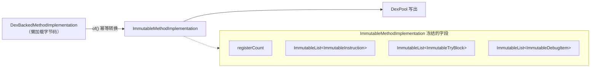

# 🔐 ImmutableMethodImplementation

`ImmutableMethodImplementation` 是 `MethodImplementation` 接口的不可变实现，将方法体的寄存器数量、指令列表、try-catch 块和调试信息全部冻结为不可修改的 `ImmutableList`。

| 属性 | 值 |
|---|---|
| 源码 | [immutable/ImmutableMethodImplementation.java](https://github.com/android-security-engineer/ZjDroid-skills/blob/master/src/org/jf/dexlib2/immutable/ImmutableMethodImplementation.java) |
| 包名 | `org.jf.dexlib2.immutable` |
| 实现接口 | `MethodImplementation` |

## 🎯 职责

1. 持有不可变的指令列表（`ImmutableList<? extends ImmutableInstruction>`）
2. 持有不可变的 try-catch 块列表
3. 持有不可变的调试信息列表（行号、局部变量开始/结束等）
4. 提供 `of()` 工厂方法从任意 `MethodImplementation` 快速创建 Immutable 副本

## 🧠 关键实现

```java
public class ImmutableMethodImplementation implements MethodImplementation {
    protected final int registerCount;
    @Nonnull protected final ImmutableList<? extends ImmutableInstruction> instructions;
    @Nonnull protected final ImmutableList<? extends ImmutableTryBlock> tryBlocks;
    @Nonnull protected final ImmutableList<? extends ImmutableDebugItem> debugItems;

    public ImmutableMethodImplementation(int registerCount,
            @Nullable Iterable<? extends Instruction> instructions,
            @Nullable List<? extends TryBlock<? extends ExceptionHandler>> tryBlocks,
            @Nullable Iterable<? extends DebugItem> debugItems) {
        this.registerCount = registerCount;
        this.instructions = ImmutableInstruction.immutableListOf(instructions);
        this.tryBlocks = ImmutableTryBlock.immutableListOf(tryBlocks);
        this.debugItems = ImmutableDebugItem.immutableListOf(debugItems);
    }

    // 静态工厂：幂等转换
    @Nullable
    public static ImmutableMethodImplementation of(@Nullable MethodImplementation impl) {
        if (impl == null) return null;
        if (impl instanceof ImmutableMethodImplementation) return (ImmutableMethodImplementation) impl;
        return new ImmutableMethodImplementation(
                impl.getRegisterCount(),
                impl.getInstructions(),
                impl.getTryBlocks(),
                impl.getDebugItems());
    }
}
```

## 📌 小结

`ImmutableMethodImplementation` 是从 `DexBackedMethodImplementation`（懒加载）转换到内存实体化方法体的桥梁。在 ZjDroid 脱壳管道中，先通过 dexbacked 层懒读取方法体字节码，再转为 `ImmutableMethodImplementation` 进行分析，最终传入 `DexPool` 写出。

::: tip 与 MutableMethodImplementation 的选择
- 只读场景（分析、写出已有方法体）→ `ImmutableMethodImplementation`
- 需要修改方法体（插桩、patch）→ `new MutableMethodImplementation(impl)`
:::

### 在脱壳管道中的位置与组成


