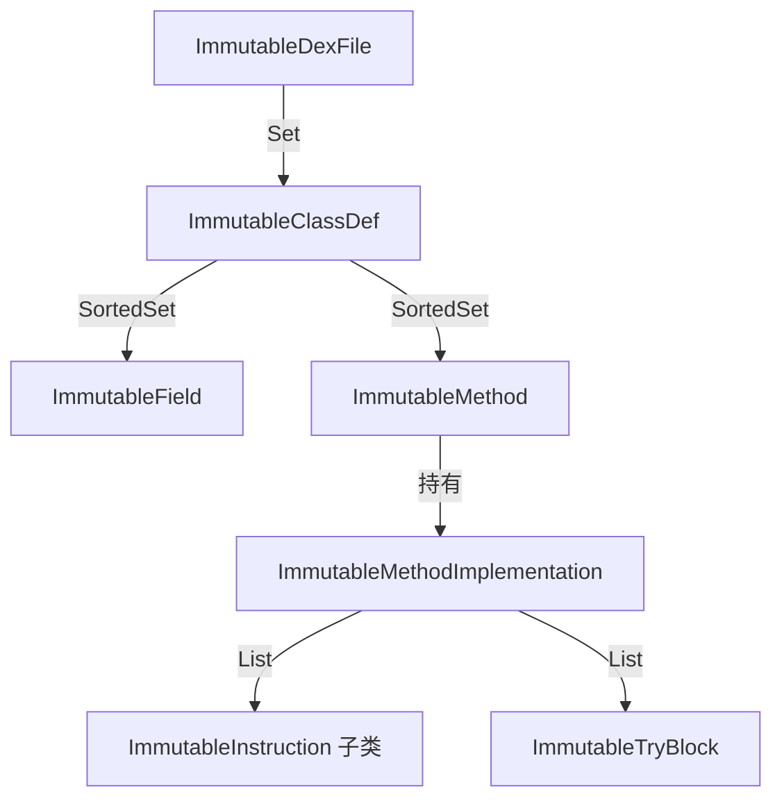

# 🧊 immutable — 不可变 DEX 对象层

`org.jf.dexlib2.immutable` 提供了 dexlib2 接口层（`iface`）的**不可变（Immutable）实现**。这些对象线程安全、可缓存，是 `MethodAnalyzer`、`DexRewriter` 和 ZjDroid 脱壳产出中的标准数据载体。

## 🗺️ 在流水线中的位置

```
DexBackedDexFile（dexbacked，另一同事负责）
       ↓ 读取字节流
ImmutableClassDef / ImmutableMethod / ImmutableMethodImplementation
       ↓ 传入分析/重写流水线
MethodAnalyzer / DexRewriter
       ↓ 最终写出
DexPool.intern(classDef) → DexWriter.writeTo()
```

## 📦 关键类清单

| 类 | 职责 |
|---|---|
| [ImmutableClassDef](./ImmutableClassDef) | 不可变类定义，持有字段、方法、注解的 ImmutableSortedSet |
| `ImmutableMethod` | 不可变方法，持有参数、注解和 `MethodImplementation` |
| `ImmutableMethodImplementation` | 不可变方法体，持有寄存器数量、不可变指令列表和 TryBlock |
| `ImmutableField` | 不可变字段定义 |
| `ImmutableDexFile` | 不可变 DEX 文件，持有 `ImmutableSet<ImmutableClassDef>` |
| `ImmutableAnnotation` | 不可变注解 |
| `ImmutableTryBlock` | 不可变 try-catch 块 |

## 🔗 结构关系



::: info 与 dexbacked 的关系
`dexbacked` 包（另一同事负责）中的 `DexBackedClassDef` 等对象是从 DEX 字节流**懒加载**的实现，访问时才解析字节。而 `ImmutableClassDef` 等是**已完全实体化**的内存对象，适合缓存、传递和写回。两者都实现相同的 `iface` 接口，可互换。
:::

::: tip ZjDroid 使用场景
`MemoryBackSmali` 从内存中获取 DEX 字节流后，通过 `DexBackedDexFile` 解析，再遍历所有类构建 `ImmutableClassDef` 集合，最后通过 `DexPool.writeTo()` 写出。  
参见 [MemoryBackSmali](/source/smali/MemoryBackSmali)。
:::
