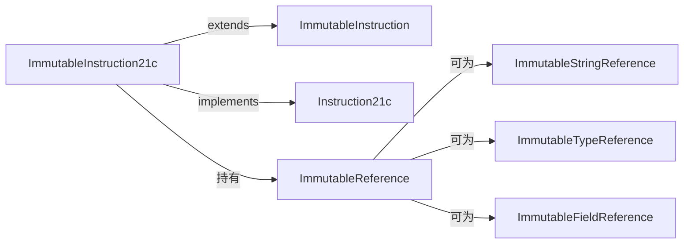

# 📌 ImmutableInstruction21c

`ImmutableInstruction21c` 是格式 `21c`（2 code units，1 寄存器，16-bit 常量池引用）的**不可变指令实现**，对应 `const-string`、`const-class`、`check-cast`、`new-instance`、`sget*`、`sput*` 等常用指令。

| 属性 | 值 |
|---|---|
| 源码 | [immutable/instruction/ImmutableInstruction21c.java](https://github.com/android-security-engineer/ZjDroid-skills/blob/master/src/org/jf/dexlib2/immutable/instruction/ImmutableInstruction21c.java) |
| 包名 | `org.jf.dexlib2.immutable.instruction` |
| 格式 | `Format.Format21c`（4 字节）|
| 实现接口 | `Instruction21c` |

## 🎯 职责

持有 1 个寄存器编号（`registerA`）和 1 个不可变引用（`ImmutableReference`），提供只读访问。引用类型由 `opcode.referenceType` 决定（STRING / TYPE / FIELD）。

## 🧠 关键实现

```java
public class ImmutableInstruction21c extends ImmutableInstruction implements Instruction21c {
    public static final Format FORMAT = Format.Format21c;

    protected final int registerA;
    @Nonnull protected final ImmutableReference reference;

    public ImmutableInstruction21c(@Nonnull Opcode opcode,
                                    int registerA,
                                    @Nonnull Reference reference) {
        super(opcode);
        this.registerA = Preconditions.checkByteRegister(registerA);  // 验证 0-255
        this.reference = ImmutableReferenceFactory.of(opcode.referenceType, reference);
    }

    // 便捷工厂方法：如果已经是 Immutable 则直接返回，否则复制
    public static ImmutableInstruction21c of(Instruction21c instruction) {
        if (instruction instanceof ImmutableInstruction21c) {
            return (ImmutableInstruction21c) instruction;
        }
        return new ImmutableInstruction21c(
                instruction.getOpcode(),
                instruction.getRegisterA(),
                instruction.getReference());
    }

    @Override public int getRegisterA() { return registerA; }
    @Nonnull @Override public ImmutableReference getReference() { return reference; }
    @Override public int getReferenceType() { return opcode.referenceType; }
    @Override public Format getFormat() { return FORMAT; }
}
```

### 典型使用：遍历 const-string 指令

```java
for (Instruction instruction : methodImpl.getInstructions()) {
    if (instruction.getOpcode() == Opcode.CONST_STRING) {
        Instruction21c instr21c = (Instruction21c) instruction;
        String str = ((StringReference) instr21c.getReference()).getString();
        int reg = instr21c.getRegisterA();
        // ZjDroid：检查是否是被加密替换的字符串
    }
}
```

## 📐 格式布局（4 字节）

```
+--------+--------+--------+--------+
| opcode |  regA  |   引用索引 (16位) |
+--------+--------+--------+--------+
  byte 0   byte 1   byte 2   byte 3
```

## 🔗 关系



## 📌 小结

`ImmutableInstruction21c` 是 dexlib2 中出现频率最高的指令类之一。`const-string` 加载字符串常量、`new-instance` 创建对象、`sget`/`sput` 访问静态字段——这些都是 ZjDroid 在分析和重建方法体时频繁遇到的指令。`of()` 静态工厂避免了不必要的对象创建。
