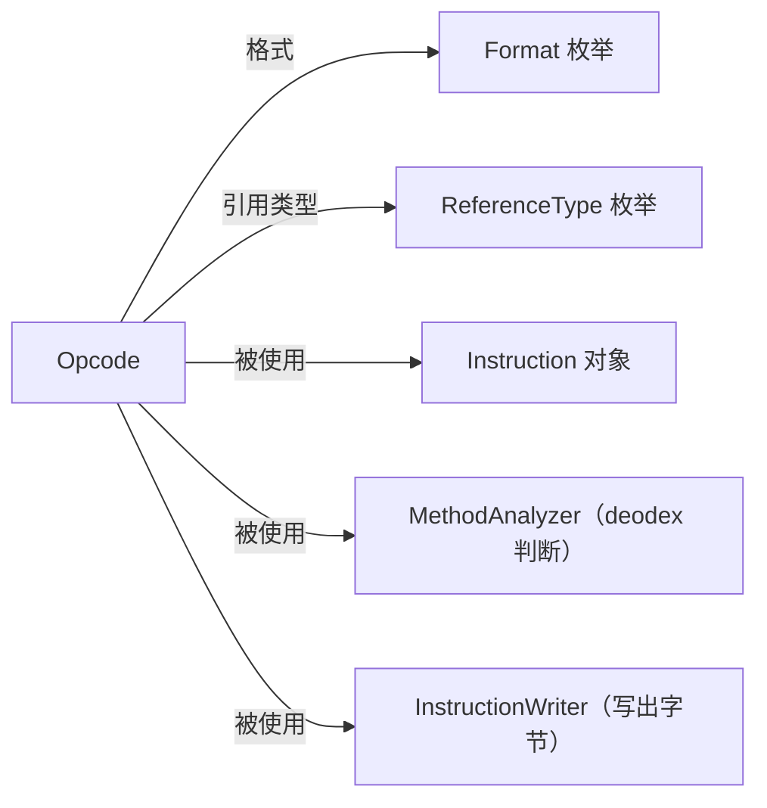

# 🎮 Opcode

`Opcode` 是 dexlib2 中对全部 Dalvik 字节码操作码的**枚举定义**，每个枚举值包含该指令的 opcode 值、助记符、格式、引用类型和运行时语义标志位。

| 属性 | 值 |
|---|---|
| 源码 | [Opcode.java](https://github.com/android-security-engineer/ZjDroid-skills/blob/master/src/org/jf/dexlib2/Opcode.java) |
| 包名 | `org.jf.dexlib2` |
| 类型 | `public enum Opcode` |

## 🎯 职责

1. 为每个 Dalvik 指令提供唯一标识（opcode 值 + 枚举名）
2. 声明每个指令对应的**格式**（`Format.Format10x` 等）
3. 声明**引用类型**（`ReferenceType.STRING/TYPE/FIELD/METHOD/NONE`）
4. 声明**语义标志位**（`CAN_THROW`、`CAN_CONTINUE`、`SETS_REGISTER` 等）
5. 标注 **ODEX_ONLY** 指令（仅在 `.odex` 中出现，需 deodex 后才能写入普通 DEX）

## 🧠 关键实现

### 枚举构造参数

```java
// 格式：opcode值, 助记符, [minApi,] 引用类型, 格式, 标志位
NOP((short)0x00, "nop", ReferenceType.NONE, Format.Format10x, Opcode.CAN_CONTINUE),
MOVE((short)0x01, "move", ReferenceType.NONE, Format.Format12x,
     Opcode.CAN_CONTINUE | Opcode.SETS_REGISTER),
CONST_STRING((short)0x1a, "const-string", ReferenceType.STRING, Format.Format21c,
             Opcode.CAN_THROW | Opcode.CAN_CONTINUE | Opcode.SETS_REGISTER, (short)0x1b),
// const-string 的第6个参数(short)0x1b 是 jumbo 变体 opcode
```

### 语义标志位

```java
public static final int CAN_THROW        = 0x1;   // 可能抛出异常
public static final int ODEX_ONLY        = 0x2;   // 仅 odex 文件
public static final int CAN_CONTINUE     = 0x4;   // 可继续执行下一条
public static final int SETS_RESULT      = 0x8;   // 设置隐式 result 寄存器
public static final int SETS_REGISTER    = 0x10;  // 设置第一个操作数寄存器
public static final int SETS_WIDE_REGISTER = 0x20; // 设置宽（64-bit）寄存器
public static final int CAN_INITIALIZE_REFERENCE = 0x40; // 可初始化 UninitRef
```

### 常用指令摘录

```java
// 控制流
GOTO((short)0x28, "goto", ReferenceType.NONE, Format.Format10t),
GOTO_16((short)0x29, "goto/16", ReferenceType.NONE, Format.Format20t),
GOTO_32((short)0x2a, "goto/32", ReferenceType.NONE, Format.Format30t),

// 方法调用
INVOKE_VIRTUAL((short)0x6e, "invoke-virtual", ReferenceType.METHOD,
               Format.Format35c, CAN_THROW | CAN_CONTINUE | SETS_RESULT),
INVOKE_STATIC((short)0x71, "invoke-static", ReferenceType.METHOD,
              Format.Format35c, CAN_THROW | CAN_CONTINUE | SETS_RESULT),

// ODEX 特有（需 deodex）
IGET_QUICK((short)0xf2, "iget-quick", ReferenceType.NONE, Format.Format22cs,
           ODEX_ONLY | ODEXED_INSTANCE_QUICK | CAN_THROW | CAN_CONTINUE | SETS_REGISTER),
```

::: warning ODEX_ONLY 指令
标有 `ODEX_ONLY` 的指令（`0xe3`~`0xfe` 段）只存在于 `.odex` 文件中，其操作数经过 vtable 优化，不携带显式引用。`MethodAnalyzer` 的 deodex 功能就是将这些指令还原为标准指令，ZjDroid 脱壳场景必须处理此类指令才能生成合法 DEX。
:::

## 🔗 关系



## 📌 小结

`Opcode` 是 dexlib2 指令模型的"字典"。在 ZjDroid 遍历方法体时，通过 `instruction.getOpcode()` 获取枚举值后，可立即判断：该指令是否可能抛异常（`CAN_THROW`）、是否需要 deodex（`ODEX_ONLY`）、使用的格式（决定如何转型获取操作数）。
