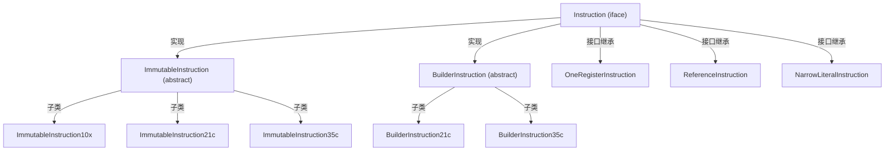

# 🔬 instruction — Dalvik 指令模型

dexlib2 的指令模型分散在三个位置，共同构成对 Dalvik/ART 字节码的完整对象表示：

| 位置 | 作用 |
|---|---|
| `iface/instruction/` | 指令接口层：`Instruction`、各操作数 trait 接口 |
| `iface/instruction/formats/` | 各格式接口（`Instruction10x`、`Instruction21c` 等） |
| `immutable/instruction/` | 不可变指令实现（`ImmutableInstruction10x` 等） |
| `builder/instruction/` | 可变指令实现（`BuilderInstruction21c` 等） |
| `Opcode.java`、`Opcodes.java` | Dalvik opcode 枚举与 API 版本映射 |

本节聚焦**指令格式体系**和 **Opcode 模型**，讲解如何理解、遍历、生成 Dalvik 字节码。

## 📐 Dalvik 指令格式命名规则

格式名 `FormatABC`：
- **A**：指令长度（code units，1 unit = 2 字节）
- **B**：寄存器数量（或特殊标记）
- **C**：操作数类型

| 格式 | 字节数 | 典型指令 | 说明 |
|---|---|---|---|
| `10x` | 2 | `nop`, `return-void` | 0 寄存器，无额外操作数 |
| `11n` | 2 | `const/4` | 1 寄存器，4-bit 立即数 |
| `11x` | 2 | `return`, `monitor-enter` | 1 寄存器 |
| `12x` | 2 | `move`, `neg-int` | 2 寄存器 |
| `21c` | 4 | `const-string`, `check-cast`, `new-instance` | 1 寄存器 + 16-bit 常量池引用 |
| `21s` | 4 | `const/16` | 1 寄存器 + 16-bit 有符号立即数 |
| `22c` | 4 | `instance-of`, `iget`, `iput` | 2 寄存器 + 16-bit 引用 |
| `35c` | 6 | `invoke-virtual`, `invoke-static`（≤5 参数） | 最多 5 寄存器 + 16-bit 引用 |
| `3rc` | 6 | `invoke-virtual/range`（任意参数） | 寄存器范围 + 16-bit 引用 |
| `51l` | 10 | `const-wide` | 1 寄存器 + 64-bit 字面量 |

## 📦 关键类清单

| 类/接口 | 职责 |
|---|---|
| [Opcode](./Opcode) | Dalvik 操作码枚举，含格式、引用类型、API 版本范围 |
| [ImmutableInstruction10x](./ImmutableInstruction10x) | 最简格式（nop/return-void）不可变实现 |
| [ImmutableInstruction21c](./ImmutableInstruction21c) | 含常量池引用的指令不可变实现 |
| [ImmutableInstruction35c](./ImmutableInstruction35c) | invoke-virtual/static 等方法调用指令 |
| [ImmutableInstructionFactory](./ImmutableInstructionFactory) | 统一工厂，从 dex 字节流反序列化为 Immutable 对象 |

## 🔗 指令层次结构

::: tip ZjDroid 脱壳中的指令遍历
`MemoryBackSmali` 在重组方法体时，遍历 `DexBackedMethodImplementation.getInstructions()` 得到 `Instruction` 对象列表，通过 `instruction.getOpcode()` 和 format-specific 接口提取操作数，再用 `ImmutableInstruction` 或 `BuilderInstruction` 重建新方法体。  
参见 [架构流水线](/architecture/unpacking-pipeline)。
:::
