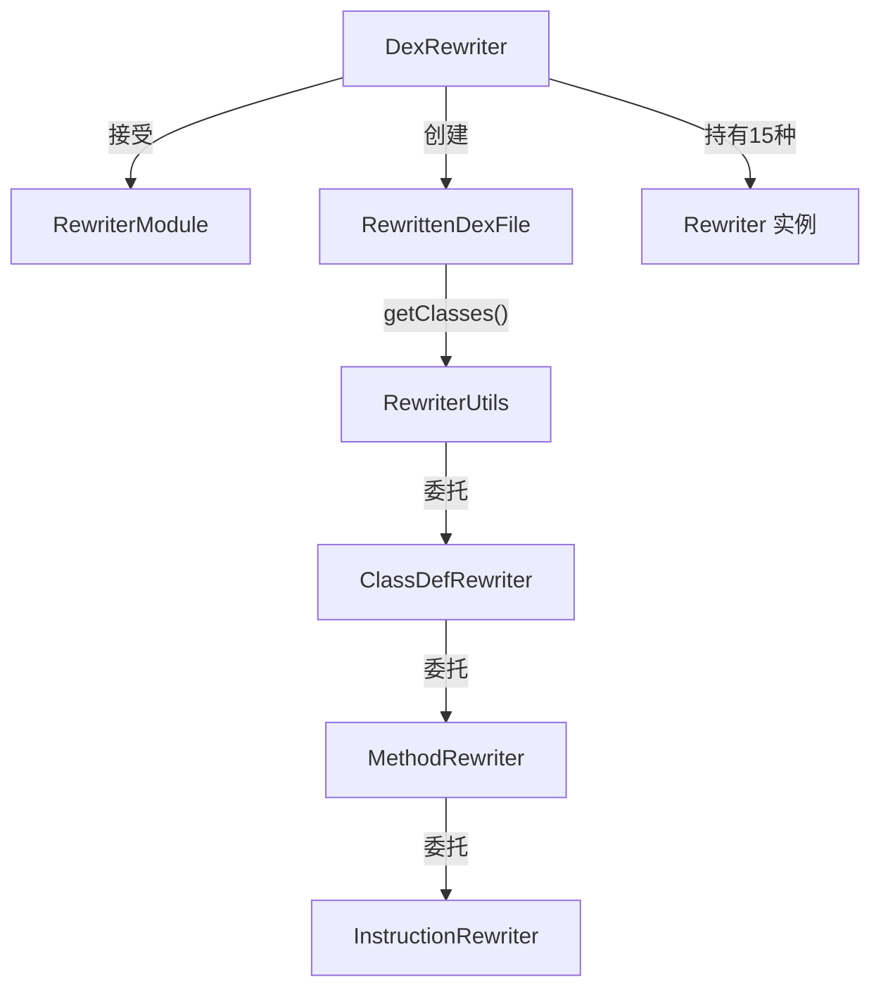

# 🔀 DexRewriter

`DexRewriter` 是 rewriter 框架的**门面类（Facade）**，接受一个 `RewriterModule` 并通过它初始化 15 种维度的 `Rewriter`，提供 `rewriteDexFile()` 作为整个变换流水线的统一入口。

| 属性 | 值 |
|---|---|
| 源码 | [rewriter/DexRewriter.java](https://github.com/android-security-engineer/ZjDroid-skills/blob/master/src/org/jf/dexlib2/rewriter/DexRewriter.java) |
| 包名 | `org.jf.dexlib2.rewriter` |
| 实现接口 | `Rewriters` |

## 🎯 职责

1. 从 `RewriterModule` 获取全部 Rewriter 实例（类、字段、方法、指令、类型、引用等 15 种）
2. 实现 `rewriteDexFile(DexFile)` 返回一个懒变换的 `RewrittenDexFile`
3. 实现 `Rewriters` 接口的所有 `getXxxRewriter()` getter，供各 `XxxRewriter` 内部回调

## 🧠 关键实现

### 构造函数（初始化所有 Rewriter）

```java
public DexRewriter(RewriterModule module) {
    this.classDefRewriter          = module.getClassDefRewriter(this);
    this.fieldRewriter             = module.getFieldRewriter(this);
    this.methodRewriter            = module.getMethodRewriter(this);
    this.methodParameterRewriter   = module.getMethodParameterRewriter(this);
    this.methodImplementationRewriter = module.getMethodImplementationRewriter(this);
    this.instructionRewriter       = module.getInstructionRewriter(this);
    this.tryBlockRewriter          = module.getTryBlockRewriter(this);
    this.exceptionHandlerRewriter  = module.getExceptionHandlerRewriter(this);
    this.debugItemRewriter         = module.getDebugItemRewriter(this);
    this.typeRewriter              = module.getTypeRewriter(this);
    this.fieldReferenceRewriter    = module.getFieldReferenceRewriter(this);
    this.methodReferenceRewriter   = module.getMethodReferenceRewriter(this);
    this.annotationRewriter        = module.getAnnotationRewriter(this);
    this.annotationElementRewriter = module.getAnnotationElementRewriter(this);
    this.encodedValueRewriter      = module.getEncodedValueRewriter(this);
}
```

### rewriteDexFile

```java
@Nonnull public DexFile rewriteDexFile(@Nonnull DexFile dexFile) {
    return new RewrittenDexFile(dexFile);
}

protected class RewrittenDexFile implements DexFile {
    @Nonnull protected final DexFile dexFile;

    public RewrittenDexFile(@Nonnull DexFile dexFile) {
        this.dexFile = dexFile;
    }

    @Override @Nonnull public Set<? extends ClassDef> getClasses() {
        return RewriterUtils.rewriteSet(getClassDefRewriter(), dexFile.getClasses());
    }
}
```

返回的 `RewrittenDexFile` 是**懒变换**的：调用 `getClasses()` 时才真正应用 `classDefRewriter`，每个 `ClassDef` 在被访问时才应用其内部的字段/方法 rewriter，以此类推。

## 🔗 关系



## 📌 小结

`DexRewriter` 采用装饰器 + 懒求值模式，使得变换操作可以精确选择粒度——只覆盖 `TypeRewriter` 时，框架自动将类型重映射传播到所有引用该类型的位置（类定义、字段类型、方法签名、常量池引用），无需手动遍历整个 DEX 结构。
