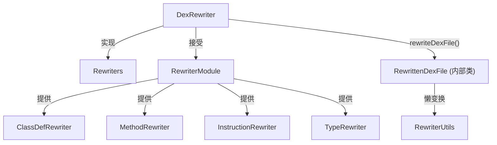

# 🔄 rewriter — DEX 变换重写框架

`org.jf.dexlib2.rewriter` 提供了一个**装饰器模式的 DEX 变换框架**：以"默认透传"为基础，通过覆盖特定 `Rewriter` 来选择性地修改 DEX 文件中的任意元素。ZjDroid 可利用此框架实现**类名重映射**、**方法签名修复**、**注解过滤**等批量变换操作。

## 📦 关键类清单

| 类 | 职责 |
|---|---|
| [DexRewriter](./DexRewriter) | 框架核心，持有所有元素级别的 `Rewriter`，提供 `rewriteDexFile()` 入口 |
| `RewriterModule` | 默认实现提供者，所有 `getXxxRewriter()` 返回透传实现，子类覆盖指定方法实现变换 |
| `Rewriter<T>` | 变换函数接口：`T rewrite(T value)` |
| `Rewriters` | 持有所有维度 `Rewriter` 的访问接口 |
| `RewriterUtils` | 静态工具，将 `Rewriter` 应用到集合（`rewriteSet`、`rewriteList`、`rewriteIterable`） |

## 🔗 整体结构



::: tip 典型使用场景：类名重映射
```java
DexRewriter rewriter = new DexRewriter(new RewriterModule() {
    @Override
    public Rewriter<String> getTypeRewriter(Rewriters rewriters) {
        return new Rewriter<String>() {
            public String rewrite(String value) {
                if (value.equals("Lcom/obfuscated/A;")) {
                    return "Lcom/original/MyClass;";
                }
                return value;
            }
        };
    }
});
DexFile result = rewriter.rewriteDexFile(inputDexFile);
```
只需覆盖 `getTypeRewriter`，框架自动将类型重映射传播到类定义、方法签名、字段引用等所有位置。
:::
