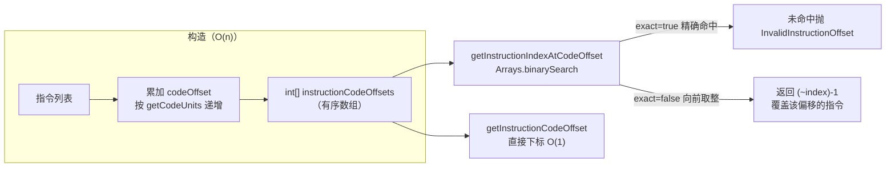

# 📏 InstructionOffsetMap

`InstructionOffsetMap` 通过一个有序整数数组提供**指令索引 ↔ code offset 的双向快速查询**，是 `MutableMethodImplementation` 克隆构造时建立 code address → index 映射的基础数据结构。

| 属性 | 值 |
|---|---|
| 源码 | [util/InstructionOffsetMap.java](https://github.com/android-security-engineer/ZjDroid-skills/blob/master/src/org/jf/dexlib2/util/InstructionOffsetMap.java) |
| 包名 | `org.jf.dexlib2.util` |
| 类型 | `public class InstructionOffsetMap` |

## 🧠 关键实现

```java
public class InstructionOffsetMap {
    @Nonnull private final int[] instructionCodeOffsets;

    public InstructionOffsetMap(@Nonnull List<? extends Instruction> instructions) {
        this.instructionCodeOffsets = new int[instructions.size()];
        int codeOffset = 0;
        for (int i = 0; i < instructions.size(); i++) {
            instructionCodeOffsets[i] = codeOffset;
            codeOffset += instructions.get(i).getCodeUnits();
        }
    }

    // 通过二分查找定位 offset 对应的指令 index
    public int getInstructionIndexAtCodeOffset(int codeOffset, boolean exact) {
        int index = Arrays.binarySearch(instructionCodeOffsets, codeOffset);
        if (index < 0) {
            if (exact) throw new InvalidInstructionOffset(codeOffset);
            return (~index) - 1;  // 向前取整到最近指令
        }
        return index;
    }

    public int getInstructionCodeOffset(int index) {
        if (index < 0 || index >= instructionCodeOffsets.length)
            throw new InvalidInstructionIndex(index);
        return instructionCodeOffsets[index];
    }
}
```

`exact=false` 模式用于定位"覆盖某偏移的指令"（如 try block 范围的边界），而 `exact=true` 要求精确命中某条指令的起始偏移。

## 📌 小结

`InstructionOffsetMap` 是一个简单但高效的数据结构，通过 `Arrays.binarySearch` 实现 O(log n) 的偏移查询。在 `MutableMethodImplementation` 的构造函数中，它被用于将 debug item 和 try block 的 code address 快速映射到对应的 `MethodLocation` 索引。

### 索引 ↔ 偏移双向查询


