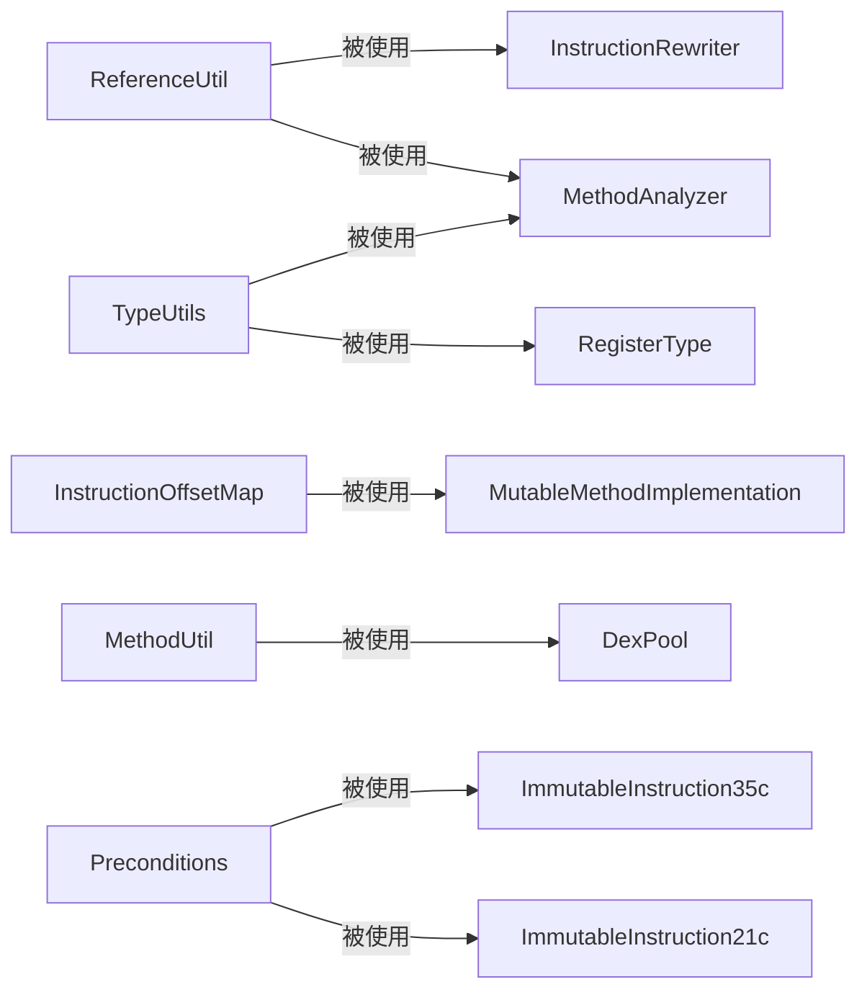

# 🛠️ util — 工具类集合

`org.jf.dexlib2.util` 包含一组贯穿整个 dexlib2 使用的**无状态工具类**，提供方法描述符格式化、引用字符串化、类型判断、指令偏移映射等常用功能。

## 📦 关键类清单

| 类 | 职责 |
|---|---|
| [ReferenceUtil](./ReferenceUtil) | 生成 DEX 方法/字段的描述符字符串（如 `Lcom/example/A;->foo()V`） |
| [InstructionOffsetMap](./InstructionOffsetMap) | 指令索引 ↔ code offset 双向查询 |
| `MethodUtil` | 判断方法 access flags（是否 static、constructor 等） |
| `TypeUtils` | 判断类型是否 wide（`J`/`D`）、是否基本类型 |
| `FieldUtil` | 过滤静态/实例字段 |
| `Preconditions` | 寄存器编号范围检查（checkByteRegister、checkNibbleRegister 等） |
| `AnnotatedBytes` | 带注解的字节序列（用于原始 DEX 数据展示） |
| `EncodedValueUtils` | EncodedValue 的编解码辅助 |

## 🔗 依赖关系

::: tip ZjDroid 常用工具
`ReferenceUtil.getMethodDescriptor()` 是 ZjDroid 输出 smali 方法签名时的核心工具；  
`InstructionOffsetMap` 在 `MutableMethodImplementation` 克隆构造时用于 code address → index 映射。
:::
