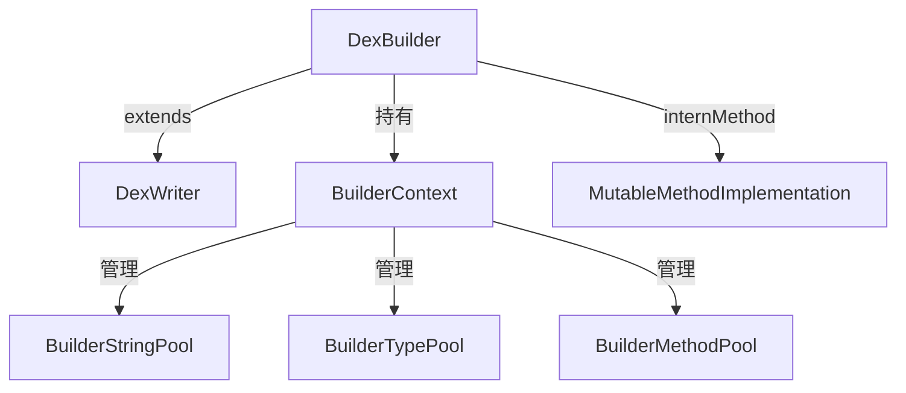

# 🏗️ DexBuilder

`DexBuilder` 是 `DexWriter` 面向 **Builder 引用类型**（`BuilderStringReference`、`BuilderMethodReference` 等）的具体实现，专为配合 `MutableMethodImplementation` 动态构建方法体后写出 DEX 而设计。

| 属性 | 值 |
|---|---|
| 源码 | [writer/builder/DexBuilder.java](https://github.com/android-security-engineer/ZjDroid-skills/blob/master/src/org/jf/dexlib2/writer/builder/DexBuilder.java) |
| 包名 | `org.jf.dexlib2.writer.builder` |
| 继承 | `extends DexWriter<BuilderStringReference, BuilderStringReference, BuilderTypeReference, ...>` |

## 🎯 职责

- 通过 `BuilderContext` 统一管理所有 Builder-typed Pool
- 提供 `internField`、`internMethod`、`internClassDef` 等精细化 intern API
- 支持方法体为 `MutableMethodImplementation` 的写出场景

## 🧠 关键实现

### 工厂方法

```java
public static DexBuilder makeDexBuilder(int api) {
    BuilderContext context = new BuilderContext();
    return new DexBuilder(api, context);
}

private DexBuilder(int api, @Nonnull BuilderContext context) {
    super(api, context.stringPool, context.typePool, context.protoPool,
          context.fieldPool, context.methodPool, context.classPool,
          context.typeListPool, context.annotationPool, context.annotationSetPool);
    this.context = context;
}
```

### internMethod — 注册方法

```java
@Nonnull public BuilderMethod internMethod(
        @Nonnull String definingClass, @Nonnull String name,
        @Nullable List<? extends MethodParameter> parameters,
        @Nonnull String returnType, int accessFlags,
        @Nonnull Set<? extends Annotation> annotations,
        @Nullable MethodImplementation methodImplementation) {
    if (parameters == null) parameters = ImmutableList.of();
    return new BuilderMethod(
        context.methodPool.internMethod(definingClass, name, parameters, returnType),
        context.internMethodParameters(parameters),
        accessFlags,
        context.annotationSetPool.internAnnotationSet(annotations),
        methodImplementation == null ? null :
            context.methodImplementationPool.internMethodImplementation(methodImplementation));
}
```

`methodImplementation` 可以是 `MutableMethodImplementation`，支持在写出前对方法体进行插桩或修改。

## 🔗 关系



## 📌 小结

`DexBuilder` 适合需要**细粒度控制**每个 Builder 引用的场景，如 ZjDroid 在重建方法体时使用 `MutableMethodImplementation` 动态插入跟踪指令，再通过 `DexBuilder.internMethod` 注册后写出完整 DEX。

::: info 与 DexPool 的选择
- `DexPool`：输入已有 `ClassDef` 对象，批量写出，简单快速
- `DexBuilder`：需要动态构建或修改方法体，与 builder/ 子包配合使用
:::
