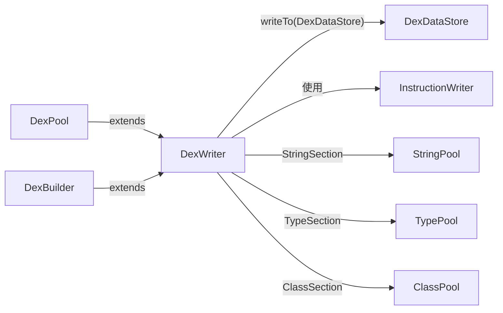

# 📦 DexWriter

`DexWriter` 是 dexlib2 写出层的**抽象基类**，以泛型参数化方式协调 strings、types、protos、fields、methods、classes 等所有 DEX section 的写出顺序，并负责最终计算 SHA-1 签名与 Adler32 校验和。

| 属性 | 值 |
|---|---|
| 源码 | [writer/DexWriter.java](https://github.com/android-security-engineer/ZjDroid-skills/blob/master/src/org/jf/dexlib2/writer/DexWriter.java) |
| 包名 | `org.jf.dexlib2.writer` |
| 类型 | `public abstract class DexWriter<StringKey, StringRef, TypeKey, TypeRef, ProtoKey, FieldRefKey, MethodRefKey, ClassKey, AnnotationKey, AnnotationSetKey, TypeListKey, FieldKey, MethodKey, EncodedValue, AnnotationElement>` |
| 直接子类 | `DexPool`、`DexBuilder` |

## 🎯 职责

1. **持有所有 Section 引用**：stringSection、typeSection、protoSection、fieldSection、methodSection、classSection 等
2. **按 DEX 规范顺序写出所有 section**
3. **计算并写入 SHA-1 签名、Adler32 校验和**（保证 DEX 合法性）
4. **支持延迟输出流**（`DeferredOutputStream`），先写数据区，后填写 Header 偏移量

## 🧠 关键实现

### writeTo — 主写出流程

```java
public void writeTo(@Nonnull DexDataStore dest,
                    @Nonnull DeferredOutputStreamFactory tempFactory) throws IOException {
    int dataSectionOffset = getDataSectionOffset();
    DexDataWriter headerWriter = outputAt(dest, 0);
    DexDataWriter indexWriter = outputAt(dest, HeaderItem.ITEM_SIZE);
    DexDataWriter offsetWriter = outputAt(dest, dataSectionOffset);
    try {
        writeStrings(indexWriter, offsetWriter);
        writeTypes(indexWriter);
        writeTypeLists(offsetWriter);
        writeProtos(indexWriter);
        writeFields(indexWriter);
        writeMethods(indexWriter);
        writeEncodedArrays(offsetWriter);
        writeAnnotations(offsetWriter);
        writeAnnotationSets(offsetWriter);
        writeAnnotationSetRefs(offsetWriter);
        writeAnnotationDirectories(offsetWriter);
        writeDebugAndCodeItems(offsetWriter, tempFactory.makeDeferredOutputStream());
        writeClasses(indexWriter, offsetWriter);
        writeMapItem(offsetWriter);
        writeHeader(headerWriter, dataSectionOffset, offsetWriter.getPosition());
    } finally { ... }
    updateSignature(dest);
    updateChecksum(dest);
}
```

### 数据区偏移计算

```java
private int getDataSectionOffset() {
    return HeaderItem.ITEM_SIZE
        + stringSection.getItems().size() * StringIdItem.ITEM_SIZE
        + typeSection.getItems().size() * TypeIdItem.ITEM_SIZE
        + protoSection.getItems().size() * ProtoIdItem.ITEM_SIZE
        + fieldSection.getItems().size() * FieldIdItem.ITEM_SIZE
        + methodSection.getItems().size() * MethodIdItem.ITEM_SIZE
        + classSection.getItems().size() * ClassDefItem.ITEM_SIZE;
}
```

数据区偏移 = Header + 各 ID Section 大小之和（固定大小条目）。

### SHA-1 签名更新

```java
private void updateSignature(@Nonnull DexDataStore dataStore) throws IOException {
    MessageDigest md = MessageDigest.getInstance("SHA-1");
    byte[] buffer = new byte[4 * 1024];
    InputStream input = dataStore.readAt(HeaderItem.SIGNATURE_DATA_START_OFFSET);
    int bytesRead = input.read(buffer);
    while (bytesRead >= 0) {
        md.update(buffer, 0, bytesRead);
        bytesRead = input.read(buffer);
    }
    byte[] signature = md.digest();
    // 写回 Header 对应偏移
}
```

::: warning 签名范围
SHA-1 签名从 `SIGNATURE_DATA_START_OFFSET`（即 checksum 字段之后）开始计算到文件末尾，而 Adler32 校验从 signature 字段之后开始。两者计算区域不同，均由 `updateSignature/updateChecksum` 在数据全部写完后再回填。
:::

## 🔗 关系



## 📌 小结

`DexWriter` 是 ZjDroid DEX 写出能力的基石。每次脱壳后重建 DEX 文件时，最终都调用其 `writeTo()` 方法，它按固定的 section 顺序写出所有数据，再通过 `DexDataStore` 抽象适配内存或文件两种存储后端。
