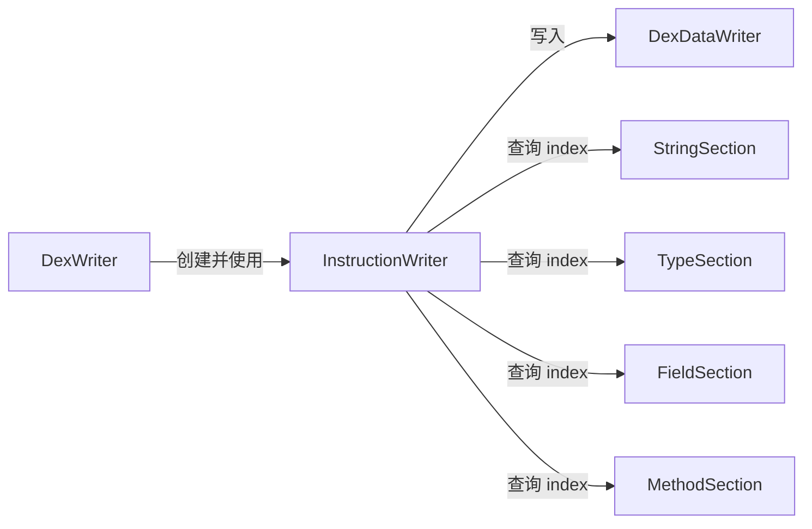

# ✍️ InstructionWriter

`InstructionWriter` 将 dexlib2 的 `Instruction` 对象树按照 Dalvik 字节码格式写入 `DexDataWriter` 字节流。它是 DEX code_item 写出的最底层执行者。

| 属性 | 值 |
|---|---|
| 源码 | [writer/InstructionWriter.java](https://github.com/android-security-engineer/ZjDroid-skills/blob/master/src/org/jf/dexlib2/writer/InstructionWriter.java) |
| 包名 | `org.jf.dexlib2.writer` |
| 类型 | `public class InstructionWriter<StringRef, TypeRef, FieldRefKey, MethodRefKey>` |

## 🎯 职责

为每种 Dalvik 指令格式提供一个 `write(InstructionXXX)` 方法，将 opcode + 操作数写成规范的字节序列。处理 30+ 种指令格式。

## 🧠 关键实现

### 构造与注入

```java
InstructionWriter(@Nonnull DexDataWriter writer,
                  @Nonnull StringSection<?, StringRef> stringSection,
                  @Nonnull TypeSection<?, ?, TypeRef> typeSection,
                  @Nonnull FieldSection<?, ?, FieldRefKey, ?> fieldSection,
                  @Nonnull MethodSection<?, ?, ?, MethodRefKey, ?> methodSection) {
    this.writer = writer;
    this.stringSection = stringSection;
    ...
}
```

写引用类型指令时（如 `const-string`），通过 `stringSection.getItemIndex(ref)` 将引用转换为 DEX section 编号再写出。

### 典型格式写出（Format10t — 单字节跳转）

```java
public void write(@Nonnull Instruction10t instruction) {
    try {
        writer.write(instruction.getOpcode().value);
        writer.write(instruction.getCodeOffset());
    } catch (IOException ex) { ... }
}
```

### 含引用的格式（Format21c — 宽引用单寄存器）

```java
public void write(@Nonnull Instruction21c instruction) {
    try {
        writer.write(instruction.getOpcode().value);
        writer.write(instruction.getRegisterA());
        writer.writeUshort(getReferenceIndex(instruction));
    } catch (IOException ex) { ... }
}
```

`getReferenceIndex` 根据引用类型分发到 string/type/field/method section 查询编号。

## 🔗 关系



## 📌 小结

`InstructionWriter` 是指令模型与二进制字节之间的"翻译器"。脱壳后重组的方法体指令（`BuilderInstruction` 或 `ImmutableInstruction`）最终都通过此类写入 DEX code_item，是写出流水线中连接逻辑与物理的关键节点。
