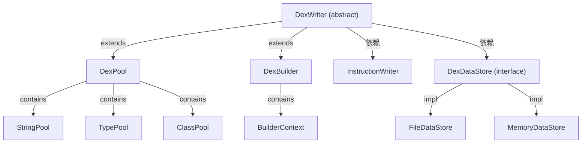

# 📤 writer — DEX 序列化写出层

`org.jf.dexlib2.writer` 是 dexlib2 中负责将内存中的 DEX 对象模型**序列化为标准 `.dex` 二进制文件**的核心子包。ZjDroid 在完成内存脱壳、重建类结构后，最终依赖此层将重组后的 DEX 写回磁盘，是"脱壳产出"的最后一公里。

## 🗺️ 在 DEX 写出流水线中的位置

```
内存中 ClassDef/Method/Instruction 对象
          ↓ intern（注册到各 Pool）
      DexPool / DexBuilder（writer/pool 或 writer/builder）
          ↓ writeTo(DexDataStore)
         DexWriter（抽象核心）
          ↓ 按节区顺序写出
   stringSection → typeSection → protoSection
   fieldSection  → methodSection → classSection
   encodedArray  → annotation → code_items
          ↓
   FileDataStore / MemoryDataStore（io 子包）
          ↓
       最终 .dex 文件
```

## 📦 关键类清单

| 类 | 职责 |
|---|---|
| [DexWriter](./DexWriter) | 抽象基类，协调所有节区写出顺序，计算 SHA-1 签名和 Adler32 校验和 |
| [DexPool](./DexPool) | 面向**接口对象**的具体写出器，调用方传入 `ClassDef` 即可 |
| [DexBuilder](./DexBuilder) | 面向**Builder 引用类型**的写出器，配合 `MutableMethodImplementation` 使用 |
| [InstructionWriter](./InstructionWriter) | 将 `Instruction` 对象按格式写成字节流 |
| [DexDataStore](./io-DexDataStore) | I/O 抽象接口，屏蔽文件 vs 内存实现 |
| [MemoryDataStore](./io-MemoryDataStore) | 内存写出，ZjDroid 在 `MemoryBackSmali` 中使用此方式 |
| [FileDataStore](./io-FileDataStore) | 直接写入 `RandomAccessFile`，用于磁盘脱壳产出 |
| [BaseIndexPool](./pool-BaseIndexPool) | 所有 Index Section 池的公共基类（intern → 分配编号） |

## 🔗 整体结构关系



::: tip ZjDroid 脱壳场景
`MemoryBackSmali` 先用 `DexPool.writeTo(MemoryDataStore)` 在内存中生成 DEX 字节流，再通过文件系统落盘，全程无需临时文件。  
参见 [MemoryBackSmali](/source/smali/MemoryBackSmali)、[架构流水线](/architecture/unpacking-pipeline)。
:::

::: info 节区写出顺序
`DexWriter.writeTo()` 严格按照 DEX 规范的 section 顺序写出，依次为：  
strings → types → type_lists → protos → fields → methods → encoded_arrays → annotations → annotation_sets → annotation_set_refs → annotation_directories → debug_info + code_items → class_defs → map_list → header
:::
