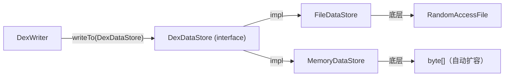

# 💾 DexDataStore

`DexDataStore` 是 writer 层的 **I/O 后端抽象接口**，将 DEX 数据的写入目标（文件 / 内存）与 `DexWriter` 的序列化逻辑解耦。

| 属性 | 值 |
|---|---|
| 源码 | [writer/io/DexDataStore.java](https://github.com/android-security-engineer/ZjDroid-skills/blob/master/src/org/jf/dexlib2/writer/io/DexDataStore.java) |
| 包名 | `org.jf.dexlib2.writer.io` |
| 类型 | `public interface DexDataStore` |
| 实现类 | `FileDataStore`、`MemoryDataStore` |

## 🎯 职责

提供三个核心操作，支持随机偏移写入和读取（DEX Header 需要在所有数据写完后回填）：

```java
public interface DexDataStore {
    @Nonnull OutputStream outputAt(int offset);
    @Nonnull InputStream readAt(int offset);
    void close() throws IOException;
}
```

## 🧠 关键实现

### MemoryDataStore — 内存后端

```java
public class MemoryDataStore implements DexDataStore {
    private byte[] buf;

    public MemoryDataStore(int initialCapacity) {
        buf = new byte[initialCapacity];
    }

    @Nonnull @Override public OutputStream outputAt(final int offset) {
        return new OutputStream() {
            private int position = offset;
            @Override public void write(byte[] b, int off, int len) throws IOException {
                growBufferIfNeeded(position + len);
                System.arraycopy(b, off, buf, position, len);
                position += len;
            }
        };
    }

    private void growBufferIfNeeded(int index) {
        if (index < buf.length) return;
        buf = Arrays.copyOf(buf, (int)((index + 1) * 1.2));
    }
    // ...
}
```

内部维护一个自动扩容的 `byte[]`，`outputAt(offset)` 返回一个从指定偏移开始写的 `OutputStream`，**多个 writer 可以同时写不同区域**（Header 区、Index 区、Data 区）。

### FileDataStore — 文件后端

```java
public class FileDataStore implements DexDataStore {
    private final RandomAccessFile raf;

    public FileDataStore(@Nonnull File file) throws FileNotFoundException, IOException {
        this.raf = new RandomAccessFile(file, "rw");
        this.raf.setLength(0);  // 清空文件
    }

    @Nonnull @Override public OutputStream outputAt(int offset) {
        return new RandomAccessFileOutputStream(raf, offset);
    }
    @Nonnull @Override public InputStream readAt(int offset) {
        return new RandomAccessFileInputStream(raf, offset);
    }
}
```

底层使用 `RandomAccessFile`，`outputAt` 创建一个从指定字节偏移开始写的流，实现任意位置回填。

## 🔗 关系



## 📌 小结

`DexDataStore` 让 `DexWriter` 完全不关心数据最终去哪里。ZjDroid 的 `MemoryBackSmali` 使用 `MemoryDataStore` 先在内存中组装完整 DEX，再通过 `getData()` 获取字节数组落盘；而直接写磁盘的场景则使用 `FileDataStore`。

::: tip ZjDroid 使用场景
参见 [MemoryBackSmali](/source/smali/MemoryBackSmali)：脱壳时选择 `MemoryDataStore` 避免中间文件，写完后用 `buf = store.getData()` 获取字节流。
:::
