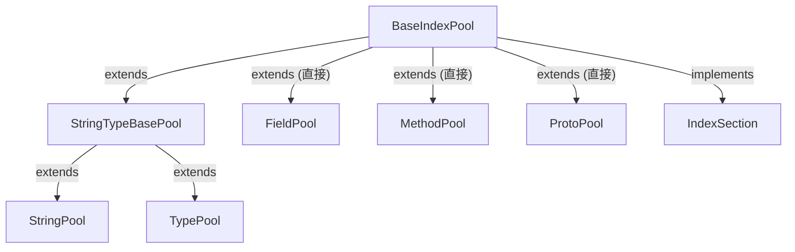

# 🗂️ BaseIndexPool

`BaseIndexPool<Key>` 是 writer/pool 子包中所有 **Index Section 池**（StringPool、TypePool、FieldPool、MethodPool、ProtoPool）的公共基类，实现"intern（注册）→ 分配编号"的核心逻辑。

| 属性 | 值 |
|---|---|
| 源码 | [writer/pool/BaseIndexPool.java](https://github.com/android-security-engineer/ZjDroid-skills/blob/master/src/org/jf/dexlib2/writer/pool/BaseIndexPool.java) |
| 包名 | `org.jf.dexlib2.writer.pool` |
| 类型 | `public abstract class BaseIndexPool<Key> implements IndexSection<Key>` |
| 直接子类 | `StringTypeBasePool`（→ `StringPool`、`TypePool`）、`FieldPool`、`MethodPool`、`ProtoPool` |

## 🎯 职责

维护一个 `Map<Key, Integer>` 映射表：
- `intern(key)` 将对象注册进来（由子类实现）
- `getItemIndex(key)` 查询已分配的 DEX section 编号
- `getItems()` 返回所有条目，供 `DexWriter` 顺序写出

## 🧠 关键实现

```java
public abstract class BaseIndexPool<Key> implements IndexSection<Key> {
    @Nonnull protected final Map<Key, Integer> internedItems = Maps.newHashMap();

    @Nonnull @Override public Collection<? extends Map.Entry<? extends Key, Integer>> getItems() {
        return internedItems.entrySet();
    }

    @Override public int getItemIndex(@Nonnull Key key) {
        Integer index = internedItems.get(key);
        if (index == null) {
            throw new ExceptionWithContext("Item not found.: %s", getItemString(key));
        }
        return index;
    }

    @Nonnull protected String getItemString(@Nonnull Key key) {
        return key.toString();
    }
}
```

### StringPool 示例（子类实现 intern）

```java
public class StringPool extends StringTypeBasePool
        implements StringSection<CharSequence, StringReference> {

    public void intern(@Nonnull CharSequence string) {
        internedItems.put(string.toString(), 0);  // 0 为占位，编号在 assign 阶段分配
    }

    @Override public boolean hasJumboIndexes() {
        return internedItems.size() > 65536;  // 超过 64K 字符串需用 jumbo 指令
    }
}
```

::: info intern 的两阶段设计
1. **注册阶段**（intern）：把 key 放入 map，编号先为 0
2. **排序 + 分配阶段**（由 `DexWriter` 触发）：对 map 条目排序后，顺序填写 0,1,2,...，这就是 DEX section 中的 index
:::

## 🔗 关系



## 📌 小结

`BaseIndexPool` 统一了 DEX 各 ID Section 的"先注册、后编号"模式。脱壳时，`ClassPool.intern(classDef)` 会递归调用各子 Pool 的 `intern`，将类定义中涉及的所有字符串、类型、字段、方法全部注册，确保写出时每个引用都有合法编号。
