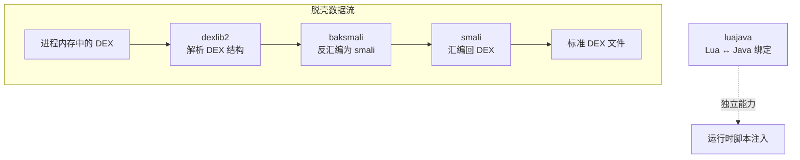

# 🔧 内嵌工具链原理

ZjDroid 的脱壳与反汇编能力并非全部自研——它在源码里**内嵌**了几套成熟的第三方工具链，并对它们做了"面向内存"的改造。理解这些工具链，才能真正看懂脱壳最后一公里是怎么落地的。

::: info 为什么要讲第三方代码
一般项目不会讲第三方库。但 ZjDroid 的核心价值恰恰在于**把这些原本面向"文件"的工具改造成面向"进程内存"**——例如让 dexlib2 直接读进程内存里的 DEX 结构。不讲清这些库，就讲不清脱壳。
:::

## 🧱 四套工具链

| 工具链 | 内嵌包 | 类数量级 | 作用 | 精讲 |
|--------|--------|---------|------|------|
| **dexlib2** | `org.jf.dexlib2` | 300+ | DEX 文件读写与指令模型 | [dexlib2 原理](/internals/dexlib2/) |
| **baksmali** | `org.jf.baksmali` | 40+ | DEX → smali 反汇编器 | [baksmali 原理](/internals/baksmali/) |
| **smali** | `org.jf.smali` | 10+ | smali → DEX 汇编器 | [smali 原理](/internals/smali/) |
| **luajava** | `org.keplerproject.luajava` | 9 | Lua 虚拟机与 Java 互操作 | [luajava 原理](/internals/luajava/) |
| **native so** | （无源码） | — | `libdvmnative.so` 直读 Dalvik 内存 | [Native 层原理](/internals/native/) |

## 🎯 ZjDroid 的改造点

ZjDroid 对这些工具链做的关键改造（详见各章）：

- **dexlib2**：新增 `MemoryReader` / `MemoryDexFileItemPointer` 等，让 dexlib2 能从**内存指针**而非文件读取 DEX 结构。
- **baksmali**：复用其 `Adaptors` 反汇编逻辑，但输入源换成内存 DEX。
- **smali/DexFileBuilder**：用反汇编得到的 smali 重新汇编，产出一个**结构完整、可被工具识别**的 DEX（修复加固破坏的头部）。
- **luajava**：通过 hook `findLibrary` 让目标进程加载 `libluajava.so`，从而在目标进程内跑 Lua。

## 📖 阅读建议

这些库体量庞大，本章**按"包 + 关键类"系统讲解**，不追求逐类流水账，而是让你理解：

1. 每个包在整条流水线里的位置与职责；
2. 关键类的设计意图与协作方式；
3. ZjDroid 具体用到了哪些入口、改了什么。

先读 [dexlib2 原理](/internals/dexlib2/) 建立"DEX 对象模型"的认识，是理解全部内容的基础。
