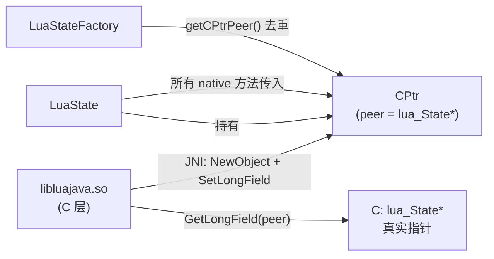

# 🔗 CPtr — C 指针的 Java 抽象

`CPtr` 是 luajava 架构中最底层的"接缝"类：它在 Java 侧安全地持有一个 C 语言指针（`lua_State*`），使 Java 代码可以传递 native 指针而无需直接操作 `long` 裸值。

| 属性 | 值 |
|------|-----|
| 源文件 | [`src/org/keplerproject/luajava/CPtr.java`](https://github.com/ZjDroid/ZjDroid/blob/master/src/org/keplerproject/luajava/CPtr.java) |
| 包 | `org.keplerproject.luajava` |
| 核心字段 | `private long peer`（64 位安全的指针值） |
| 实例化方式 | 仅由 native 代码通过 JNI 创建（Java 侧无公开构造器） |

## 🎯 职责

- **封装 native 指针**：将 `lua_State*`（或其他 C 指针）的地址存储在 `long peer` 字段，以 64 位方式保存，兼容 ARM64；
- **传递给 native 方法**：`LuaState` 的所有 `private native` 方法都接受 `CPtr` 参数，native 层通过 JNI 取出 `peer` 字段值还原为 C 指针；
- **身份比较**：`equals()` 方法比较两个 `CPtr` 的 `peer` 值，用于 `LuaStateFactory.insertLuaState()` 中的去重检测（`getCPtrPeer()` 公开暴露 peer 值）。

## 🧠 关键实现

```java
private long peer;

protected long getPeer() {
    return peer;
}
```

`peer` 字段为 `private`，JNI 代码在 C 侧通过 `GetLongField` 读写它（luajava C 源码中通常是 `(*env)->GetLongField(env, cptr, fieldID)`），Java 侧通过 `getPeer()` 访问（`protected` 可见性）。

Java 侧无法直接构造 `CPtr`：

```java
CPtr() {}  // 包级可见，native 通过反射或 JNI 实例化后设置 peer
```

### 在 LuaState 中的使用

```java
private CPtr luaState;  // 持有 lua_State*

public long getCPtrPeer() {
    return (luaState != null) ? luaState.getPeer() : 0;
}
```

`getCPtrPeer() == 0` 可用来判断 LuaState 是否已关闭（`close()` 后 `luaState = null`）。

## 🔗 关系



::: warning 64 位兼容性
`peer` 使用 `long`（64 位），确保在 ARM64 设备上指针不会被截断。早期 32 位 JNI 绑定曾用 `int`，会在 64 位系统上产生指针截断 bug。luajava 在这里的设计是正确的。
:::

## 📌 小结

`CPtr` 是 luajava JNI 架构的"钥匙"——它以最小的代码（约 70 行）完成了 Java long ↔ C pointer 的安全封装，是 `LuaState` 与 native 层之间唯一的物理连接点。

> 交叉参见：[LuaState](/internals/luajava/LuaState) · [libluajava 原理](/internals/native/libluajava)
