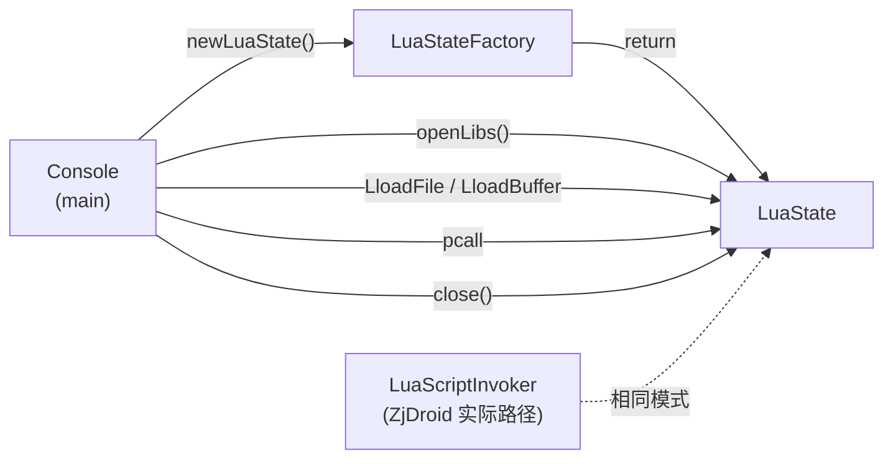

# 🖥️ Console — luajava 演示控制台

`Console` 是 luajava 官方提供的交互式 Lua REPL（Read-Eval-Print-Loop）示例程序，展示了如何在 Java 应用中嵌入和启动一个 Lua 虚拟机。ZjDroid 将其内嵌但**并未直接使用**。

| 属性 | 值 |
|------|-----|
| 源文件 | [`src/org/keplerproject/luajava/Console.java`](https://github.com/ZjDroid/ZjDroid/blob/master/src/org/keplerproject/luajava/Console.java) |
| 包 | `org.keplerproject.luajava` |
| 入口 | `public static void main(String[] args)` |
| 在 ZjDroid 中的状态 | 随 luajava 源码一起内嵌，但不被调用 |

## 🎯 职责

作为 luajava 的"Hello World"，展示完整的 VM 使用模式：

1. 通过 `LuaStateFactory.newLuaState()` 创建 VM；
2. 调用 `L.openLibs()` 打开所有标准 Lua 库；
3. 批量执行文件参数，或进入交互式 REPL。

## 🧠 代码解读

### 批量执行模式（有命令行参数时）

```java
for (int i = 0; i < args.length; i++) {
    int res = L.LloadFile(args[i]);   // 加载 Lua 文件（编译不执行）
    if (res == 0) {
        res = L.pcall(0, 0, 0);       // 执行
    }
    if (res != 0) {
        throw new LuaException("Error on file: " + args[i] + ". " + L.toString(-1));
    }
}
```

注意两步走：先 `LloadFile`（相当于 `luaL_loadfile`，只编译），再 `pcall` 执行。这样可以在编译阶段就捕获语法错误，避免运行时才发现。

### REPL 模式（无参数时）

```java
while ((line = inp.readLine()) != null && !line.equals("exit")) {
    int ret = L.LloadBuffer(line.getBytes(), "from console");
    if (ret == 0) ret = L.pcall(0, 0, 0);
    if (ret != 0) System.err.println("Error: " + L.toString(-1));
    System.out.print("> ");
}
L.close();
```

逐行读取、编译、执行，出错打印错误消息并继续，输入 `exit` 退出后调用 `L.close()` 释放 VM。

## 与 ZjDroid 实际用法的对比

| 对比项 | Console（演示） | LuaScriptInvoker（ZjDroid 实际） |
|--------|---------------|-------------------------------|
| VM 创建 | `LuaStateFactory.newLuaState()` | 相同 |
| 库加载 | `L.openLibs()` | 相同 |
| 执行方式 | `LdoFile` / `LloadBuffer + pcall` | `LdoString` / `LdoFile` |
| 自定义函数 | 无 | `log`、`tostring` |
| 输出 | `System.out` | `Logger.log` |
| so 加载 | 无需 hook（直接运行） | 需 hook `findLibrary` |

::: info 为什么要内嵌 Console？
luajava 是整包引入的，Console 是原始库的一部分。它作为文档和示例存在于源码中，对 ZjDroid 的功能没有影响，但对理解 luajava 的正确使用方式很有帮助。
:::

## 🔗 关系



## 📌 小结

`Console` 是 luajava 的"教学标本"，其完整展示的"创建 VM → 打开库 → 执行脚本 → 关闭 VM"模式被 `LuaScriptInvoker` 直接复用，唯一不同之处在于 ZjDroid 还需要先通过 hook `findLibrary` 解决 so 在目标进程中的加载问题。

> 交叉参见：[LuaState](/internals/luajava/LuaState) · [LuaStateFactory](/internals/luajava/LuaStateFactory) · [LuaScriptInvoker](/source/collecter/LuaScriptInvoker)
