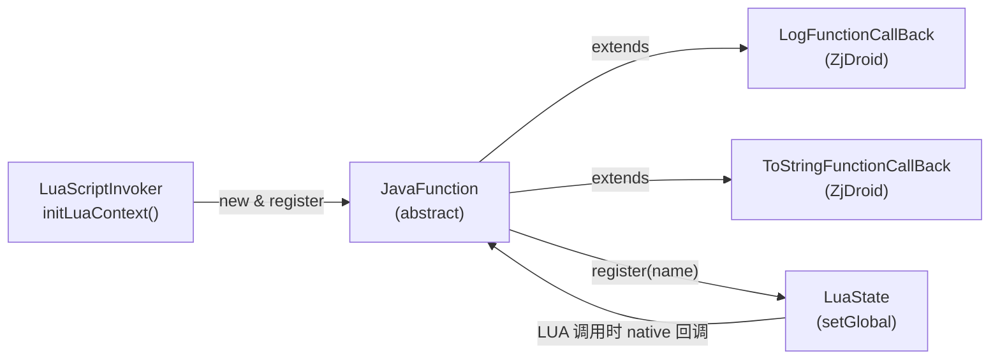

# ⚡ JavaFunction — Java 函数注册为 Lua 全局函数

`JavaFunction` 是将任意 Java 方法暴露给 Lua 脚本的桥梁抽象类，ZjDroid 用它向 Lua 环境注入 `log`、`tostring` 等工具函数。

| 属性 | 值 |
|------|-----|
| 源文件 | [`src/org/keplerproject/luajava/JavaFunction.java`](https://github.com/ZjDroid/ZjDroid/blob/master/src/org/keplerproject/luajava/JavaFunction.java) |
| 包 | `org.keplerproject.luajava` |
| 修饰符 | `public abstract class` |
| 核心方法 | `abstract int execute() throws LuaException` |

## 🎯 职责

- 提供统一的 Java→Lua 函数注册接口；
- 子类实现 `execute()` 方法，从 Lua 栈读取参数，执行逻辑，返回压栈的结果数量；
- `register(String name)` 将实例压栈并设为 Lua 全局变量，之后 Lua 脚本可直接调用 `name(...)`。

## 🧠 关键实现

### 抽象合约

```java
public abstract int execute() throws LuaException;
```

返回值是压入栈的**返回值数量**，这遵循 Lua C API 的 `lua_CFunction` 规范（`int (*lua_CFunction)(lua_State *L)`）。

### 参数读取

```java
public LuaObject getParam(int idx) {
    return L.getLuaObject(idx);
}
```

在 `execute()` 中通过 `getParam(2)`、`getParam(3)`... 读取参数（index 1 是函数自身，参数从 2 开始）。

### 注册为全局函数

```java
public void register(String name) throws LuaException {
    synchronized (L) {
        L.pushJavaFunction(this);  // 将 JavaFunction 实例压栈
        L.setGlobal(name);         // 弹出并设为全局变量
    }
}
```

`L.pushJavaFunction` 调用 native 方法 `_pushJavaFunction`，在 Lua VM 内创建一个 userdata 绑定到这个 Java 对象，并设置 `__call` 元方法使其可被调用。

## ZjDroid 中的两个实现

`LuaScriptInvoker` 内部定义了两个匿名子类：

**`LogFunctionCallBack`**

```java
// Lua 中: log("hello")
// 读 index=2 的字符串参数，调用 Logger.log
String message = this.L.getLuaObject(2).getString();
Logger.log(message);
return 0;  // 无返回值
```

**`ToStringFunctionCallBack`**

```java
// Lua 中: tostring(javaObject)
// 将 Java 对象序列化为 JSON 后 log 输出
String objDsrc = JsonWriter.parserInstanceToJson(this.getParam(i).getObject());
Logger.log(objDsrc);
return 0;
```

::: tip 扩展方式
任何需要在 Lua 脚本中调用的 Java 能力，都可以通过继承 `JavaFunction` 并在 `initLuaContext` 中 `register` 来扩展。例如可以注册 `dumpDex`、`hookMethod` 等函数，让 Lua 脚本直接触发脱壳或 hook。
:::

## 🔗 关系



## 📌 小结

`JavaFunction` 用一个极简的抽象类，将"Java 方法"变成了"Lua 全局函数"。ZjDroid 通过它向 Lua 环境注入了调试辅助工具，未来可以轻松扩展更多 Hook/脱壳 API。

> 交叉参见：[LuaState](/internals/luajava/LuaState) · [LuaObject](/internals/luajava/LuaObject) · [LuaScriptInvoker](/source/collecter/LuaScriptInvoker)
