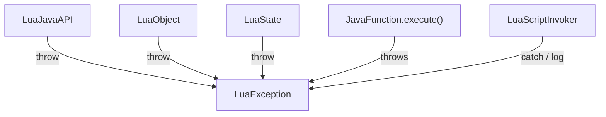

# ⚠️ LuaException — luajava 统一异常

`LuaException` 是 luajava 所有错误的统一异常类型，继承自 `java.lang.Exception`，同时支持字符串消息和 Java 异常链两种构造方式。

| 属性 | 值 |
|------|-----|
| 源文件 | [`src/org/keplerproject/luajava/LuaException.java`](https://github.com/ZjDroid/ZjDroid/blob/master/src/org/keplerproject/luajava/LuaException.java) |
| 包 | `org.keplerproject.luajava` |
| 父类 | `java.lang.Exception`（受检异常） |

## 🎯 职责

- 统一 Lua 运行时错误（语法错误、运行时错误、内存错误）的 Java 表示；
- 包装 Java 侧发生的异常（反射失败、类型不匹配等），使其以统一形式在调用链中传播。

## 🧠 关键实现

```java
public LuaException(String str) {
    super(str);
}

public LuaException(Exception e) {
    super((e.getCause() != null) ? e.getCause() : e);
}
```

两个构造器：
- **字符串构造**：用于 Lua 错误（如 `"Runtime error. <lua message>"`）；
- **异常包装构造**：用于 Java 反射操作失败时，将原始异常包装（优先取 `getCause()` 以剥离 `InvocationTargetException` 等包装层）。

## 抛出场景一览

| 抛出位置 | 场景 |
|---------|------|
| `LuaObject.call()` | `pcall` 返回非 0 错误码 |
| `LuaJavaAPI.objectIndex()` | 找不到匹配方法签名 |
| `LuaJavaAPI.javaNewInstance()` | 类不存在（`ClassNotFoundException`） |
| `LuaJavaAPI.getObjInstance()` | 无匹配构造器 |
| `LuaObject.createProxy()` | 非 Table 类型无法创建代理 |
| `LuaState.pushJavaFunction()` | native 层创建 userdata 失败 |

## 🔗 关系



::: tip ZjDroid 中的异常处理
`LuaScriptInvoker.invokeScript()` 并未 try-catch `LuaException`——如果 `LdoString` 返回非 0，只是打印日志并 return。这意味着 Lua 脚本的语法/运行时错误会被静默处理，调试时需要检查 logcat。
:::

## 📌 小结

`LuaException` 是 luajava 错误体系的"汇集点"，设计简洁：受检异常确保调用方必须处理，异常链包装保留了原始错误信息。

> 交叉参见：[LuaState](/internals/luajava/LuaState) · [LuaJavaAPI](/internals/luajava/LuaJavaAPI)
