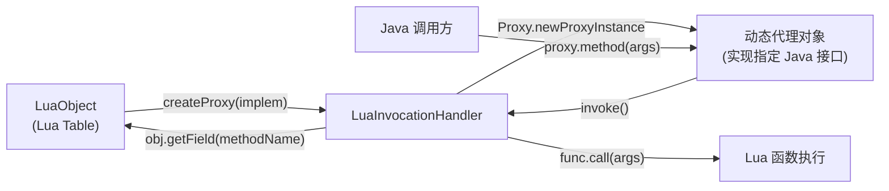

# 🪄 LuaInvocationHandler — 让 Lua Table 实现 Java 接口

`LuaInvocationHandler` 实现了 `java.lang.reflect.InvocationHandler`，使 Lua 的 Table 对象可以通过 Java 动态代理机制伪装成任意 Java 接口的实现。

| 属性 | 值 |
|------|-----|
| 源文件 | [`src/org/keplerproject/luajava/LuaInvocationHandler.java`](https://github.com/ZjDroid/ZjDroid/blob/master/src/org/keplerproject/luajava/LuaInvocationHandler.java) |
| 包 | `org.keplerproject.luajava` |
| 实现接口 | `java.lang.reflect.InvocationHandler` |
| 核心字段 | `LuaObject obj`（被代理的 Lua Table） |

## 🎯 职责

当 Java 代码调用代理对象的某个接口方法时，`LuaInvocationHandler.invoke()` 负责：

1. 用接口方法名在 Lua Table 中查找同名字段（期望是一个 Lua 函数）；
2. 将 Java 调用参数传入 Lua 函数并执行；
3. 将 Lua 返回值转换回 Java 类型并返回。

## 🧠 关键实现

```java
public Object invoke(Object proxy, Method method, Object[] args) throws LuaException {
    synchronized(obj.L) {
        String methodName = method.getName();
        LuaObject func = obj.getField(methodName);  // 查表找函数

        if (func.isNil()) return null;  // 未实现则返回 null

        Class retType = method.getReturnType();
        if (retType.equals(Void.class) || retType.equals(void.class)) {
            func.call(args, 0);         // void 方法不取返回值
            return null;
        } else {
            Object ret = func.call(args, 1)[0];
            if (ret instanceof Double)  // Lua 数字需要转换为 Java 期望的类型
                ret = LuaState.convertLuaNumber((Double) ret, retType);
            return ret;
        }
    }
}
```

### 使用流程示例

```lua
-- Lua 脚本中定义一个"实现"Runnable 的 Table
local r = {}
function r.run()
    log("Hello from Lua!")
end

-- 转为 Java Runnable
local runnable = luajava.createProxy("java.lang.Runnable", r)
-- 然后可以传给 new Thread(runnable):start()
```

### 数字类型转换

Lua 只有一种数字类型（double），当 Java 接口方法返回 `int`、`long`、`float` 等时，`LuaState.convertLuaNumber(Double, Class)` 负责做精确转换，避免类型不匹配导致的 ClassCastException。

## 🔗 关系



::: info 局限性
- 若 Lua Table 中没有与接口方法同名的字段，`invoke` 返回 `null`（void 方法）或空值，不会报错；
- 异常处理：若 Lua 函数抛出异常，会被封装为 `LuaException` 抛出；
- 不支持 Java 默认方法（default method）的特殊分发。
:::

## 📌 小结

`LuaInvocationHandler` 是 luajava 最优雅的特性之一——它让动态语言 Lua 的"鸭子类型"与 Java 强类型接口无缝对接，使 Lua 脚本能以 Table 的形式"实现"任何 Java 接口。

> 交叉参见：[LuaObject](/internals/luajava/LuaObject) · [LuaState](/internals/luajava/LuaState)
