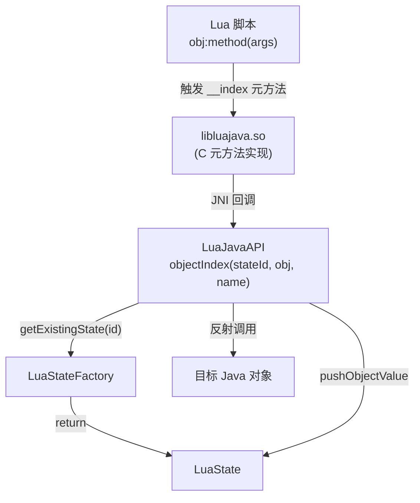

# 🔌 LuaJavaAPI — native 回调的反射分发中心

`LuaJavaAPI` 是 luajava 中最"魔法"的部分：它的方法**由 native 代码（C）主动回调**，而非由 Java 代码直接调用。通过 Java 反射，它让 Lua 脚本能够访问任意 Java 对象的字段和方法、创建新实例、加载 Java 库。

| 属性 | 值 |
|------|-----|
| 源文件 | [`src/org/keplerproject/luajava/LuaJavaAPI.java`](https://github.com/ZjDroid/ZjDroid/blob/master/src/org/keplerproject/luajava/LuaJavaAPI.java) |
| 包 | `org.keplerproject.luajava` |
| 修饰符 | `public final class`，构造器私有（工具类） |
| 调用方 | `libluajava.so` native 层（通过 JNI 直接调用） |

## 🎯 职责

| 方法 | 触发场景 | 作用 |
|------|---------|------|
| `objectIndex(stateId, obj, methodName)` | Lua 访问 Java 对象的成员 `obj:method(args)` | 用反射找到并调用匹配的方法 |
| `classIndex(stateId, clazz, searchName)` | Lua 访问 Java 类的静态成员 | 先查字段再查方法，返回 1/2/0 |
| `javaNewInstance(stateId, className)` | Lua 中 `luajava.newInstance("com.example.Foo")` | 用反射创建新实例 |
| `javaNew(stateId, clazz)` | Lua 中 `luajava.new(clazz)` | 同上，但接受 Class 对象 |
| `javaLoadLib(stateId, className, methodName)` | Lua 中 `luajava.loadLib(...)` | 调用静态方法开放 Lua 库 |
| `checkField` / `checkMethod` | 内部辅助 | 检查字段/方法是否存在 |
| `createProxyObject(stateId, implem)` | Lua 中 `luajava.createProxy(...)` | 创建 Lua 实现 Java 接口的代理 |

## 🧠 关键实现

### 1. `objectIndex` — 方法分发核心

```java
Method[] methods = clazz.getMethods();
for (Method m : methods) {
    if (!m.getName().equals(methodName)) continue;
    // 参数数量匹配 + 类型转换（compareTypes）
    // 找到后 method.setAccessible(true) 并调用
    // 返回值 pushObjectValue 压栈
}
```

`compareTypes` 是关键私有方法，将 Lua 栈上的值（bool/string/number/userdata/table）与 Java 参数类型逐一比对，并完成类型转换（例如 Lua number → Java int/long/float/double）。

### 2. `stateId` 传递模式

所有公开方法第一参数都是 `int luaState`（即 stateId），通过 `LuaStateFactory.getExistingState(luaState)` 还原 `LuaState`，再在该 state 上操作栈。这是 native→Java 跨语言状态传递的标准模式。

### 3. `createProxyObject` — 与 LuaObject 联动

```java
LuaObject luaObj = L.getLuaObject(2);   // 取栈上的 Lua Table
Object proxy = luaObj.createProxy(implem); // 创建动态代理
L.pushJavaObject(proxy);                   // 压栈返回给 Lua
```

## 🔗 关系



::: warning 注意：所有方法都在 synchronized(L) 块内
这保证了同一 LuaState 上的反射操作和栈操作是原子的，但也意味着**同一 Lua VM 内不能并发执行**。
:::

## 📌 小结

`LuaJavaAPI` 是 luajava 实现"Lua 调 Java"方向的核心枢纽，它把 Java 反射系统暴露给 Lua VM，让 Lua 脚本在运行时访问任意 Java 类（包括 Android SDK、ZjDroid 自身的 API、目标 App 的私有类）。

> 交叉参见：[LuaState](/internals/luajava/LuaState) · [LuaStateFactory](/internals/luajava/LuaStateFactory) · [LuaObject](/internals/luajava/LuaObject)
