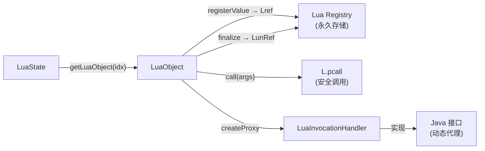

# 📦 LuaObject — Lua 值的 Java 持久引用

`LuaObject` 将一个 Lua 栈上的值"钉"在 Lua Registry 中，让 Java 代码可以在任意时刻访问、调用或代理这个 Lua 值，而不必担心它被 GC 回收。

| 属性 | 值 |
|------|-----|
| 源文件 | [`src/org/keplerproject/luajava/LuaObject.java`](https://github.com/ZjDroid/ZjDroid/blob/master/src/org/keplerproject/luajava/LuaObject.java) |
| 包 | `org.keplerproject.luajava` |
| 核心字段 | `Integer ref`（Registry key）、`LuaState L` |

## 🎯 职责

- **持久化 Lua 值**：通过 `luaL_ref` 将栈上的值移入 `LUA_REGISTRYINDEX`，返回一个整数 key（`ref`）；
- **类型查询**：`isNil / isBoolean / isNumber / isString / isFunction / isTable / isJavaObject` 等；
- **值读取**：`getBoolean / getNumber / getString / getObject`；
- **函数调用**：`call(Object[] args, int nres)` — 通过 `pcall` 安全调用，将返回值转回 Java；
- **接口代理**：`createProxy(String interfaces)` — 将 Lua Table 包装为实现指定 Java 接口的动态代理。

## 🧠 关键实现

### 1. Registry 引用机制

```java
private void registerValue(int index) {
    synchronized (L) {
        L.pushValue(index);
        int key = L.Lref(LuaState.LUA_REGISTRYINDEX.intValue());
        ref = new Integer(key);
    }
}
```

`L.Lref(LUA_REGISTRYINDEX)` 对应 `luaL_ref`，将栈顶弹出并存入 Registry，返回整数 key。之后通过 `L.rawGetI(LUA_REGISTRYINDEX, ref)` 随时重新压栈。这使得 `LuaObject` 的生命周期与 Java 对象绑定，而非与 Lua 栈帧绑定。

### 2. `finalize()` 自动释放

```java
protected void finalize() {
    if (L.getCPtrPeer() != 0)
        L.LunRef(LuaState.LUA_REGISTRYINDEX.intValue(), ref.intValue());
}
```

当 Java GC 回收 `LuaObject` 时，`luaL_unref` 会将 Registry 中对应的 Lua 值释放，防止 Lua VM 内存泄漏。

### 3. `call(Object[] args, int nres)` — 安全调用

```java
push();  // 将函数压栈
for (Object arg : args) L.pushObjectValue(arg);  // 推入参数
int err = L.pcall(nargs, nres, 0);               // 保护模式调用
// 错误处理 + 返回值提取...
```

ZjDroid 中 Lua 脚本调用 Java 方法时，返回的 Java 对象会被压栈，再通过此方法取回。

### 4. `createProxy(String implem)` — Lua 实现 Java 接口

```java
InvocationHandler handler = new LuaInvocationHandler(this);
return Proxy.newProxyInstance(classLoader, interfaces, handler);
```

例如 Lua 脚本可以写一个 table 实现 `Runnable`，然后传给 Java 的线程池。这是 luajava 最强大的特性之一。

## 🔗 关系



::: info 四种构造来源
`LuaObject` 只能由 `LuaState` 创建，有四个工厂方法：
- `getLuaObject(String globalName)` — 全局变量
- `getLuaObject(LuaObject parent, String/Number/LuaObject name)` — 表字段
- `getLuaObject(int index)` — 直接从栈索引
:::

## 📌 小结

`LuaObject` 是 Lua 值在 Java 世界的"代理人"，通过 Registry 引用实现了跨栈帧持久访问。其 `call` 方法是 Java 调用 Lua 函数的主通道，`createProxy` 则是 Lua 实现 Java 接口的神奇桥梁。

> 交叉参见：[LuaState](/internals/luajava/LuaState) · [LuaInvocationHandler](/internals/luajava/LuaInvocationHandler) · [JavaFunction](/internals/luajava/JavaFunction)
