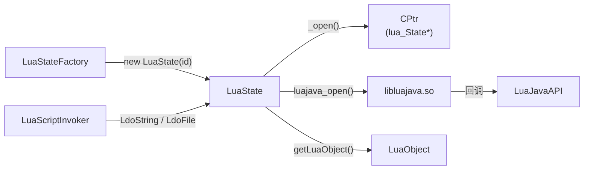

# 🧠 LuaState — Lua VM 的 Java 镜像

`LuaState` 是 luajava 最核心的类，是 Lua C API（`lua_State *`）在 Java 侧的完整映射，也是 ZjDroid 执行 Lua 脚本的直接操作对象。

| 属性 | 值 |
|------|-----|
| 源文件 | [`src/org/keplerproject/luajava/LuaState.java`](https://github.com/ZjDroid/ZjDroid/blob/master/src/org/keplerproject/luajava/LuaState.java) |
| 包 | `org.keplerproject.luajava` |
| 父类 | `Object` |
| 线程安全 | 方法均用 `synchronized` 保护 |

## 🎯 职责

- **持有 native VM 指针**：通过 `CPtr luaState` 字段持有 `lua_State*`，所有操作最终委托给 `libluajava.so`；
- **暴露 Lua C API**：将 `lua_gettop / lua_push* / lua_to* / lua_pcall` 等几十个 C 函数一一封装为同名 Java 方法；
- **扩展 Java 互操作**：提供 `pushJavaObject`、`pushJavaFunction`、`toJavaObject`、`getObjectFromUserdata` 等 Java 专属方法；
- **生命周期管理**：`close()` 调用 `_close(luaState)` 释放 native 内存，并从 `LuaStateFactory` 注销。

## 🧠 关键实现

### 1. 静态初始化块加载 native 库

```java
static {
    System.loadLibrary(LUAJAVA_LIB);  // "luajava"
}
```

此处的 `System.loadLibrary("luajava")` 在**模块自身进程**中可正常找到 so；在**目标进程**中则依赖 [`LuaScriptInvoker.start()`](/source/collecter/LuaScriptInvoker) 预先 hook `findLibrary` 完成重定向。

### 2. 两种构造方式

```java
protected LuaState(int stateId)     // 新建 lua_State，由 LuaStateFactory 调用
protected LuaState(CPtr luaState)   // 包装已有 lua_State（用于子协程）
```

两种构造均会调用 `luajava_open(luaState, stateId)` 向 Lua 注册 stateId，使 native 层能在回调时通过 `LuaStateFactory.getExistingState(id)` 找回 Java 对象。

### 3. native 方法命名约定

所有 native 方法以 `_` 开头（如 `_open`、`_pcall`），公开 Java 方法作为薄包装层（去掉 `_` 后同名）。这种分层保证了 Java 侧可做 null 检查、类型转换等工作。

### 4. `pushObjectValue` — 类型自动分发

```java
public void pushObjectValue(Object obj) throws LuaException
```

这是 Java→Lua 类型映射的总入口，按 `null → nil`、`Boolean`、`Number`、`String`、`JavaFunction`、`LuaObject`、`byte[]`、其他对象（userdata）的顺序依次判断，确保 Java 值正确落地为 Lua 栈上的原生类型或 userdata。

### 5. `toJavaObject` — Lua→Java 反向映射

```java
public synchronized Object toJavaObject(int idx) throws LuaException
```

从栈索引取值并转回 Java：boolean/string/number 直接转换，function/table 包装为 `LuaObject`，userdata 提取包装的 Java 对象。

### 6. `LdoString` / `LdoFile` — 脚本执行入口

```java
public int LdoString(String str)   // 对应 luaL_dostring
public int LdoFile(String fileName) // 对应 luaL_dofile
```

ZjDroid 的 `LuaScriptInvoker.invokeScript()` 和 `invokeFileScript()` 直接调用这两个方法执行脚本。返回 0 表示成功，非 0 为错误码。

## 🔗 关系



::: warning 线程安全注意事项
`LuaState` 所有 native 调用都用 `synchronized` 修饰，但**不同 LuaState 实例之间不互斥**。若多线程并发调用 `invokeScript`，`LuaStateFactory.newLuaState()` 会为每个线程创建独立的 VM 实例，彼此隔离。
:::

## 📌 小结

`LuaState` 是 luajava 的"上帝对象"，完整覆盖 Lua 5.1 C API 并扩展了 Java 互操作能力。ZjDroid 通过它的 `LdoString`/`LdoFile` 执行脚本，通过 `pushJavaObject`/`toJavaObject` 实现数据双向传递。理解 `LuaState` 就是理解 luajava 最关键的一步。

> 交叉参见：[LuaStateFactory](/internals/luajava/LuaStateFactory) · [CPtr](/internals/luajava/CPtr) · [LuaScriptInvoker](/source/collecter/LuaScriptInvoker)
