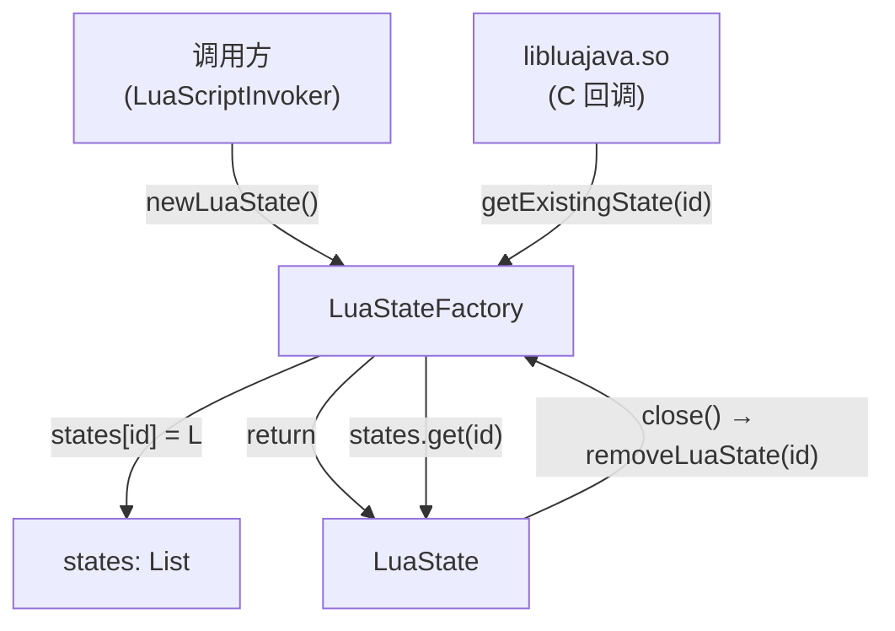

# 🏭 LuaStateFactory — Lua VM 实例池

`LuaStateFactory` 是 luajava 的 VM 生命周期管家，维护一个全局 `List`，让 native 层能通过整数 ID 反查到对应的 Java `LuaState` 实例。

| 属性 | 值 |
|------|-----|
| 源文件 | [`src/org/keplerproject/luajava/LuaStateFactory.java`](https://github.com/ZjDroid/ZjDroid/blob/master/src/org/keplerproject/luajava/LuaStateFactory.java) |
| 包 | `org.keplerproject.luajava` |
| 修饰符 | `public final class`，构造器私有（工具类） |

## 🎯 职责

native 层的 C 代码无法持有 Java 对象引用，但可以持有整数。`LuaStateFactory` 的设计核心是：**用 List 下标（stateId）作为 native ↔ Java 之间的握手凭证**。

- 每个 `LuaState` 在创建时注册到 `states` 列表，获得一个 `stateId`；
- native 层回调 `LuaJavaAPI` 时传入 `stateId`，后者用 `getExistingState(stateId)` 还原 `LuaState` 对象；
- `LuaState.close()` 时将对应槽位置为 `null`，供后续复用。

## 🧠 关键实现

### 核心数据结构

```java
private static final List states = new ArrayList();
```

使用**原始 `List`**（非泛型），槽位可以为 `null`（已关闭的 state）。所有公开方法均为 `synchronized static`，保证多线程安全。

### `newLuaState()` 流程

```
1. getNextStateIndex() — 找第一个 null 槽位（或末尾）
2. new LuaState(i) — 创建实例，构造器内调用 _open() 和 luajava_open()
3. states.add(i, L) — 存入列表
4. return L
```

### `insertLuaState(L)` — 去重插入

用于包装已有 `lua_State*`（如子协程场景）。先遍历 states 看是否已存在（按 `getCPtrPeer()` 比较指针），存在则直接返回已有 id，否则找空槽插入。

### `removeLuaState(idx)` — 软删除

```java
states.add(idx, null);  // 槽位置 null，不缩容
```

这是典型的"空槽复用"模式，避免频繁增删导致 id 重排。

## 🔗 关系



::: tip ZjDroid 使用方式
`LuaScriptInvoker.invokeScript()` 每次都调用 `LuaStateFactory.newLuaState()` 创建新 VM，执行完毕后 `luaState.close()` 销毁。这保证了每次脚本执行的状态完全隔离。
:::

## 📌 小结

`LuaStateFactory` 是一个线程安全的整数索引 VM 注册表，解决了"C native 代码如何找回 Java 对象"这一跨语言难题。它的设计非常紧凑（仅 ~120 行），但在整个 luajava 架构中不可或缺。

> 交叉参见：[LuaState](/internals/luajava/LuaState) · [LuaJavaAPI](/internals/luajava/LuaJavaAPI)
