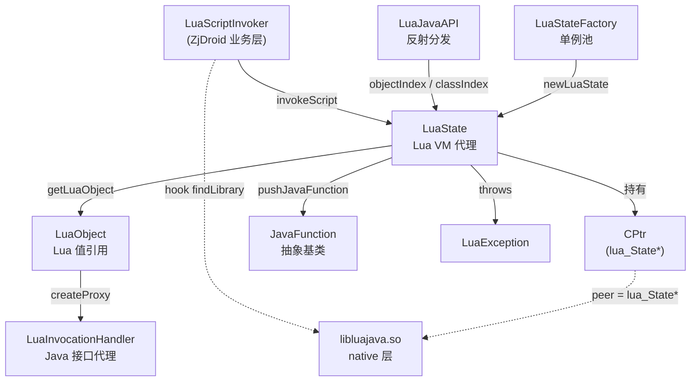

# 🌙 luajava：Lua ↔ Java 互操作层

luajava 是 [Kepler Project](http://www.keplerproject.org/luajava/) 出品的开源 Lua/Java 绑定库（MIT 协议），ZjDroid 将其完整内嵌于 `src/org/keplerproject/luajava/`，用于**在目标进程中执行 Lua 脚本**，实现运行时脚本化反汇编与内存操控。

::: info 为什么是 Lua？
Lua 极其轻量（虚拟机只有约 200KB），嵌入 JVM 进程时对目标 App 的性能影响极小。ZjDroid 通过 luajava 让安全研究员用 Lua 脚本直接调用 Android Java API，无需重新编译 Xposed 模块。
:::

## 🧱 包结构与 9 个类

| 类 | 文件 | 职责 | 精讲 |
|----|------|------|------|
| `LuaState` | `LuaState.java` | Lua VM 全部 C API 的 Java 镜像，核心入口 | [详见](/internals/luajava/LuaState) |
| `LuaStateFactory` | `LuaStateFactory.java` | LuaState 单例池，维护 stateId ↔ 实例映射 | [详见](/internals/luajava/LuaStateFactory) |
| `LuaObject` | `LuaObject.java` | Lua 值的 Java 包装，支持 call / createProxy | [详见](/internals/luajava/LuaObject) |
| `JavaFunction` | `JavaFunction.java` | Java 函数注册为 Lua 全局函数的抽象基类 | [详见](/internals/luajava/JavaFunction) |
| `LuaJavaAPI` | `LuaJavaAPI.java` | native 回调 Java 时通过反射分发方法调用 | [详见](/internals/luajava/LuaJavaAPI) |
| `LuaInvocationHandler` | `LuaInvocationHandler.java` | 让 Lua 表实现 Java 接口的动态代理处理器 | [详见](/internals/luajava/LuaInvocationHandler) |
| `LuaException` | `LuaException.java` | luajava 统一异常，支持包装 Java 异常链 | [详见](/internals/luajava/LuaException) |
| `CPtr` | `CPtr.java` | C 指针的 Java 抽象，持有 lua_State* 的地址 | [详见](/internals/luajava/CPtr) |
| `Console` | `Console.java` | 演示用 Lua REPL 控制台（ZjDroid 未直接使用） | [详见](/internals/luajava/Console) |

## 🗺️ 整体架构

## 🔗 与 ZjDroid 的关系

ZjDroid 使用 luajava 的唯一业务入口是 [`LuaScriptInvoker`](/source/collecter/LuaScriptInvoker)：

1. `start()` — hook `dalvik.system.BaseDexClassLoader.findLibrary`，让目标进程能找到 `libluajava.so`；
2. `invokeScript(script)` — 通过 `LuaStateFactory.newLuaState()` 创建 VM，注册 `log`、`tostring` 等自定义函数，然后执行 Lua 字符串；
3. `invokeFileScript(path)` — 从文件加载并执行 Lua 脚本。

::: tip 交叉阅读
- so 加载机制 → [so 加载原理](/internals/native/so-loading)
- native 桥接 → [架构：native bridge](/architecture/native-bridge)
- Lua 注入全流程 → [架构：lua injection](/architecture/lua-injection)
:::

## 📌 小结

luajava 为 ZjDroid 提供了"**在目标进程中动态执行任意 Lua 脚本**"的能力，其 9 个类分工明确：VM 管理（LuaState / LuaStateFactory）、值桥接（LuaObject / CPtr）、函数桥接（JavaFunction / LuaJavaAPI）、接口代理（LuaInvocationHandler）、错误处理（LuaException）、演示工具（Console）。
