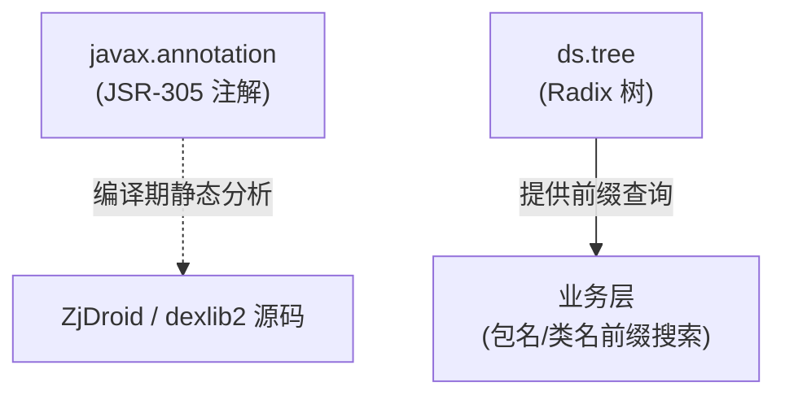

# 🧩 第三方工具概览

ZjDroid 除了内嵌 dexlib2/baksmali/smali/luajava 这四套主要工具链外，还包含两个小型第三方工具：JSR-305 注解库和 Radix 树实现。本章对它们做概览介绍。

## 📦 两个工具

| 包 | 文件位置 | 来源 | 作用 |
|----|---------|------|------|
| `javax.annotation` | `src/javax/annotation/` | JSR-305 / FindBugs | 静态分析注解（`@Nonnull`、`@Nullable` 等） |
| `ds.tree` | `src/ds/tree/` | Tahseen Ur Rehman（MIT） | Patricia Trie / Radix 树，供前缀查询使用 |

## 🗺️ 在 ZjDroid 中的位置

## 📖 详细说明

- [javax.annotation — JSR-305 注解](/internals/misc/javax-annotation)
- [ds.tree — Radix 树实现](/internals/misc/radix-tree)
