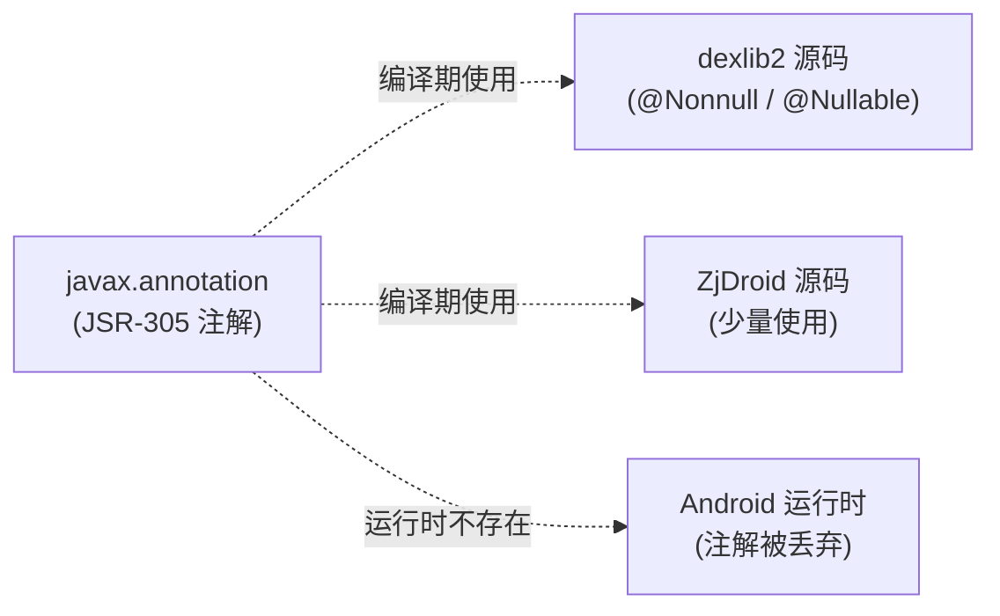

# 🏷️ javax.annotation — JSR-305 静态分析注解

`javax.annotation` 包内嵌了 [JSR-305](https://jcp.org/en/jsr/detail?id=305)（Annotations for Software Defect Detection）的实现，主要来自 FindBugs / SpotBugs 项目。

## 🎯 作用

这些注解**只在编译期起作用**，用于帮助 IDE（IntelliJ IDEA / Android Studio）和静态分析工具（FindBugs、SpotBugs、Checker Framework）检测潜在的空指针异常、类型污染等 bug。

**运行时无任何开销**（大多数注解的 `@Retention` 是 `CLASS` 或 `SOURCE`，不进入运行时字节码）。

## 📋 主要注解一览

| 注解 | 用途 |
|------|------|
| `@Nonnull` / `@NonNull` | 标记参数/返回值不能为 null |
| `@Nullable` | 标记可能为 null，调用方需 null 检查 |
| `@CheckForNull` | 更强的 @Nullable，强制要求检查 |
| `@Nonnegative` | 数值必须 ≥ 0 |
| `@Signed` / `@Untainted` / `@Tainted` | 污点分析标记（安全相关，标记数据是否可信） |
| `@WillClose` / `@WillNotClose` / `@WillCloseWhenClosed` | 资源关闭责任声明 |
| `@CheckReturnValue` | 方法返回值必须被使用（不能忽略） |
| `@OverridingMethodsMustInvokeSuper` | 子类重写方法必须调用 `super` |
| `@ParametersAreNonnullByDefault` | 类/包级别：所有参数默认 `@Nonnull` |
| `@ParametersAreNullableByDefault` | 类/包级别：所有参数默认 `@Nullable` |
| `@RegEx` / `@MatchesPattern` / `@Syntax` | 字符串语法约束（正则表达式等） |
| `@PropertyKey` | 标记国际化键值 |
| `@Detainted` | 标记数据已经过安全清洗 |

## 🔧 为什么 ZjDroid 需要内嵌？

主要原因有两个：

1. **dexlib2 依赖**：dexlib2 源码大量使用 `@Nonnull`/`@Nullable` 注解，这些注解来自 `com.google.code.findbugs:jsr305` 库。将其内嵌可避免在 Android 构建中引入 Gradle 依赖；

2. **Android 环境限制**：Android SDK 的某些版本存在与标准 `javax.annotation` 冲突的情况，内嵌独立副本更可控。

## 🔗 关系

::: info 对逆向分析的意义
在阅读 dexlib2 源码时，`@Nonnull` / `@Nullable` 是理解 API 契约的重要线索：标注 `@Nonnull` 的返回值保证非 null，调用方无需额外判断；标注 `@Nullable` 的返回值必须检查，否则可能 NPE。
:::

## 📌 小结

`javax.annotation` 是一个纯编译期工具集，运行时零开销，主要服务于代码质量保障（静态分析、IDE 提示）。在阅读 ZjDroid 和 dexlib2 源码时，注意这些注解传达的 API 契约信息，有助于快速理解方法的输入输出规范。
