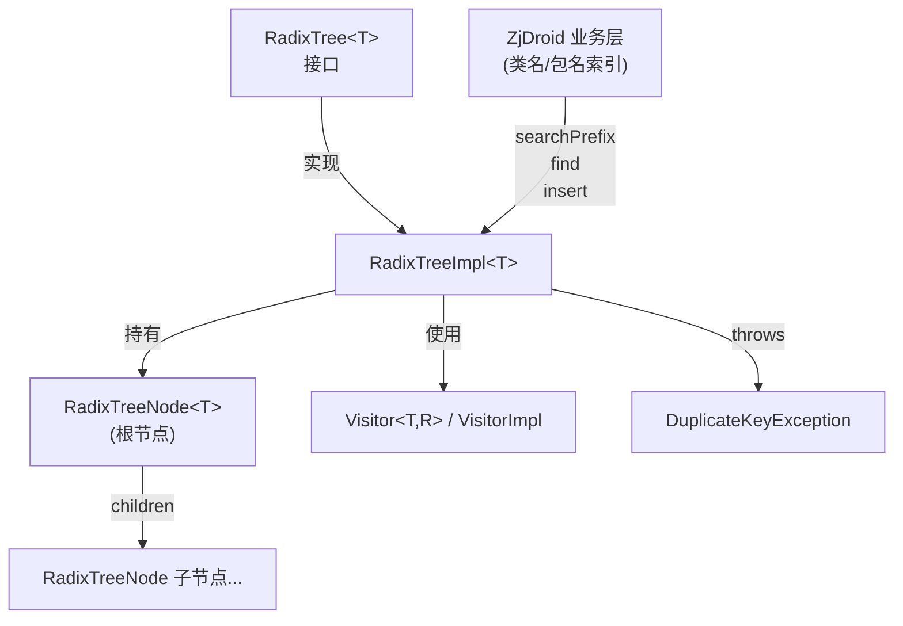

# 🌳 ds.tree — Patricia Trie / Radix 树

`ds.tree` 包提供了一个泛型 Radix 树（Patricia Trie）的 Java 实现，由 Tahseen Ur Rehman 等人编写（MIT 协议），来源于 [Google Code radixtree 项目](http://code.google.com/p/radixtree/)。ZjDroid 将其内嵌，用于**类名/包名前缀搜索**等场景。

## 📋 源文件一览

| 类 | 职责 |
|----|------|
| `RadixTree<T>` | 接口：定义 insert / delete / find / contains / searchPrefix / complete 等操作 |
| `RadixTreeImpl<T>` | 接口实现：基于边压缩 Trie 的泛型实现 |
| `RadixTreeNode<T>` | 树节点：持有 key（边标签）、value（数据）、children 列表 |
| `Visitor<T,R>` | 访问者接口：用于 visit 模式遍历（find/contains/delete 共用） |
| `VisitorImpl<T,R>` | 访问者默认实现，持有 result 字段 |
| `DuplicateKeyException` | 重复插入时抛出的受检异常 |

## 🧠 Radix 树原理

Radix 树（Patricia Trie）是 Trie 的压缩变体：**公共前缀的边被合并为单条边**，用边标签的字符串表示，而非逐字符展开。

```
普通 Trie 存储 "android", "androidx":
a → n → d → r → o → i → d (*)
                           → o → i → d → x (*)  ← 重复了前 7 个节点

Radix 树存储相同数据:
root
└── "android" (*)
    └── "x" (*)      ← 只存差异部分
```

这使得 Radix 树在存储大量有公共前缀的字符串（如 Java 包名：`com.android.xxx`）时，节点数远少于普通 Trie。

## 🧠 `RadixTreeImpl` 关键实现

### `insert` — 递归插入与节点分裂

核心逻辑计算当前 key 与节点 key 的**公共前缀长度**，分四种情况处理：
1. 完全匹配 → 标记为实节点；
2. key 是节点 key 的前缀 → 分裂节点，插入新节点；
3. 节点 key 是 key 的前缀 → 向子节点递归；
4. 无匹配 → 在当前节点添加新子节点。

### `searchPrefix(String prefix, int limit)` — 前缀搜索

这是 ZjDroid 最可能用到的方法：给定前缀，返回所有以该前缀开头的值（数量上限 `limit`）。时间复杂度为 O(P + N)，其中 P 是前缀长度，N 是结果数量。

```java
// 例：搜索所有 "com.android" 开头的类名
List<String> results = radixTree.searchPrefix("com.android", 100);
```

### `complete(String prefix)` — 无歧义补全

返回该前缀的最长无歧义扩展，类似终端 Tab 补全：

```
树中有 "blah1", "blah2"
complete("b") → "blah"  （公共无歧义部分）
complete("blah1") → "blah1"
```

### `Visitor` 模式

`find` / `contains` / `delete` 均复用同一个 `visit(key, visitor)` 遍历逻辑，通过不同的 `Visitor` 实例实现差异化行为，避免代码重复。

## 🔗 关系



::: tip 与 HashMap 的对比
在存储大量类名（如 target App 有 5000+ 类）并频繁做前缀过滤时，Radix 树比 `HashMap` + 遍历效率高得多。`searchPrefix` 直接从树根走前缀路径，时间复杂度与总类数无关。
:::

## 📌 小结

`ds.tree` 为 ZjDroid 提供了轻量、高效的字符串前缀搜索能力，是处理大量 Android 包名/类名时的理想数据结构。其实现简洁（~460 行），算法正确，MIT 协议允许自由使用。

> 参见：[javax.annotation 概览](/internals/misc/javax-annotation)
