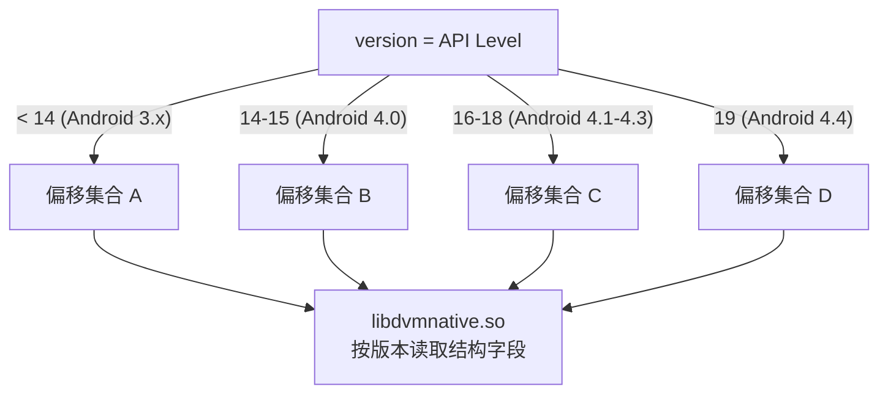
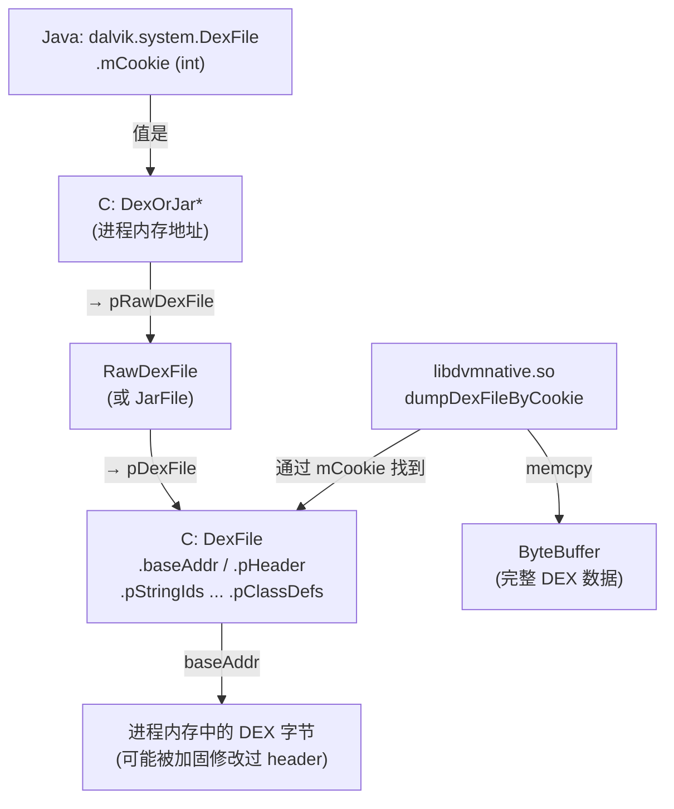

# 🏗️ Dalvik 内部结构 — 脱壳依赖的底层知识

要理解 `libdvmnative.so` 的工作原理，必须先了解 Dalvik VM 在进程内存中如何组织 DEX 文件数据。本章介绍与 ZjDroid 脱壳直接相关的几个核心结构。

::: info 参考资料
本章内容基于 AOSP Dalvik 源码（`dalvik/vm/` 目录，Android 2.3～4.4）及 DEX 文件格式规范（`dex-format.html`）。
:::

## 1. DexFile 结构（C 层）

Dalvik VM 在 C 层用 `DexFile` 结构（`libdex/DexFile.h`）表示一个加载的 DEX：

```c
struct DexFile {
    const DexHeader*    pHeader;      // DEX header_item，描述各区段偏移
    const DexStringId*  pStringIds;   // string_id_list
    const DexTypeId*    pTypeIds;     // type_id_list
    const DexProtoId*   pProtoIds;    // proto_id_list
    const DexFieldId*   pFieldIds;    // field_id_list
    const DexMethodId*  pMethodIds;   // method_id_list
    const DexClassDef*  pClassDefs;   // class_def_list
    // ...
    const u1*           baseAddr;     // DEX 文件数据起始地址
    int                 overhead;
    // ...
};
```

`libdvmnative.so` 的 `getHeaderItemPtr(cookie, version)` 正是从 Dalvik 内部找到这个结构，将各字段地址返回给 Java 层的 `DexFileHeadersPointer`。

## 2. mCookie：Java DexFile ↔ C DexFile 的桥梁

在 Java 层，`dalvik.system.DexFile` 类有一个关键私有字段：

```java
// dalvik/libcore/dalvik/src/main/java/dalvik/system/DexFile.java
private int mCookie;  // 实际上是 C 层 DexOrJar* 的指针值（转为 int）
```

`mCookie` 是 native 层分配的 `DexOrJar` 结构的地址（强制转 `int`，32 位 ABI 安全）：

```c
struct DexOrJar {
    char*       fileName;
    bool        isDex;        // 是否是裸 DEX（vs. jar/apk）
    bool        okayToFree;
    RawDexFile* pRawDexFile;  // 裸 DEX 时用
    JarFile*    pJarFile;     // jar/apk 时用
    u1*         pDexMemory;   // mmap 的 DEX 数据
};
```

ZjDroid 通过反射获取 `mCookie` 后传入 `dumpDexFileByCookie`，native 层将其转回 `DexOrJar*`，再通过 `pRawDexFile->pDexFile` 找到完整的 `DexFile` 结构。

## 3. DEX header_item 内存布局

DEX 文件起始是 `header_item`（112 字节），定义了各区段在文件中的偏移量和大小。在内存中，这些偏移量需要加上 `baseAddr` 变为绝对地址：

```
offset  size  字段
0x00    8     magic ("dex\n035\0")
0x08    4     checksum
0x0C    20    signature (SHA-1)
0x20    4     file_size
0x24    4     header_size (= 0x70)
0x28    4     endian_tag
0x2C    4     link_size
0x30    4     link_off
0x34    4     map_off
0x38    4     string_ids_size
0x3C    4     string_ids_off   ← pStringIds = base + string_ids_off
0x40    4     type_ids_size
0x44    4     type_ids_off
0x48    4     proto_ids_size
0x4C    4     proto_ids_off
0x50    4     field_ids_size
0x54    4     field_ids_off
0x58    4     method_ids_size
0x5C    4     method_ids_off
0x60    4     class_defs_size
0x64    4     class_defs_off   ← pClassDefs = base + class_defs_off
0x68    4     data_size
0x6C    4     data_off
```

`getHeaderItemPtr` 返回的 `DexFileHeadersPointer` 正是这些字段的绝对内存地址，供 dexlib2 的 `MemoryDexFileItemPointer` 使用。

## 4. 加固 App 破坏 DEX Header 的手法

加固厂商常见的反内存 dump 手段：

| 手段 | 效果 |
|------|------|
| 清零 `file_size` | 静态工具无法识别 DEX 大小 |
| 修改 `magic` 头 | 让标准工具拒绝解析 |
| 清空 `class_defs_off` | 隐藏类定义区，防止反汇编 |
| 运行时解密、执行前再加密 | 只在方法执行瞬间有明文字节码 |

ZjDroid 的对策：
- `dumpDexFileByCookie` 绕过 header 检查，直接按内存范围 dump 原始字节；
- `getHeaderItemPtr` 直接从 `DexFile` 结构读取各区段指针，不依赖 header 中可能被篡改的偏移量。

## 5. 多版本适配（version 参数）

不同 Android 版本的 Dalvik `DexOrJar` / `DvmDex` 结构体布局不同，`version` 参数（API Level）用于选择正确的偏移：



`NativeFunction` 通过 `ModuleContext.getInstance().getApiLevel()` 获取当前 API Level 并传入。

## 🔗 整体内存视图



## 📌 小结

Dalvik 的 `mCookie → DexOrJar* → DexFile* → baseAddr` 指针链是 ZjDroid 内存 dump 的核心路径。理解 `DexFile` C 结构、DEX header_item 布局和 `mCookie` 的本质，是读懂 `libdvmnative.so` 行为的必备知识。

> 交叉参见：[libdvmnative 原理](/internals/native/libdvmnative) · [NativeFunction 源码](/source/util/NativeFunction) · [架构：native bridge](/architecture/native-bridge)
