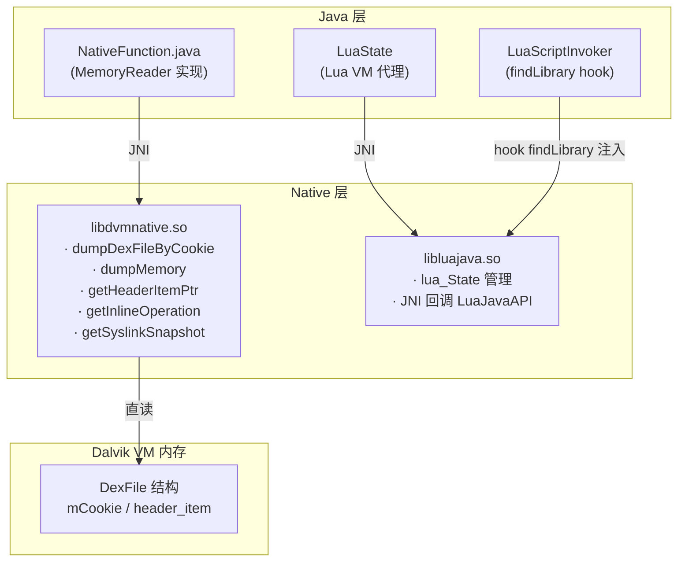

# 🔧 Native 层原理

ZjDroid 使用了两个预编译的 `.so` 动态库，它们是脱壳与 Lua 注入能力的底层基础。两者均位于 `libs/armeabi/`，无 Java 或 C 源码随仓库分发。

::: warning 无源码说明
本章所有对 native 实现的分析，均**基于 `NativeFunction.java` 中声明的 native 方法签名**推断而来，不涉及任何编造的 C 实现细节。
:::

## 📦 两个 so 文件

| 文件 | 作用 | 来源 |
|------|------|------|
| `libdvmnative.so` | ZjDroid 自研，直接操作 Dalvik VM 内存，实现 DEX dump | ZjDroid 自研 |
| `libluajava.so` | 第三方 luajava Lua↔JNI 绑定 | Kepler Project（开源） |

## 🗺️ 架构位置

## 📖 各章导航

| 章节 | 内容 |
|------|------|
| [libdvmnative 原理](/internals/native/libdvmnative) | ZjDroid 自研 so，DEX dump 与内存操作 |
| [libluajava 原理](/internals/native/libluajava) | 第三方 Lua JNI 绑定库 |
| [so 加载机制](/internals/native/so-loading) | 两个 so 如何被注入目标进程 |
| [Dalvik 内部结构](/internals/native/dalvik-internals) | DexFile / mCookie / header_item 内存模型 |

## 🔗 交叉阅读

- 脱壳流程中 native 调用链 → [架构：native bridge](/architecture/native-bridge)
- Lua 注入全流程 → [架构：lua injection](/architecture/lua-injection)
- Java 侧 native 声明 → [NativeFunction 源码](/source/util/NativeFunction)
