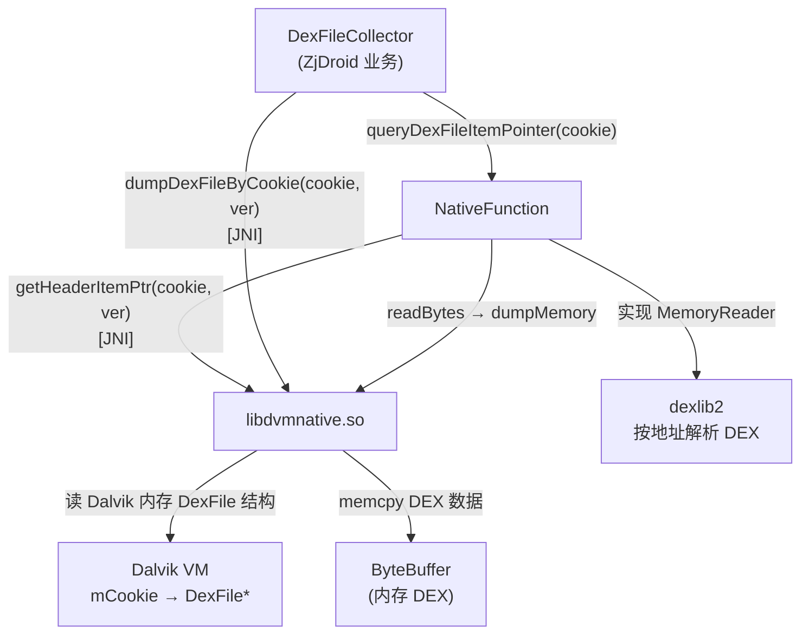

# 🛠️ libdvmnative.so — Dalvik 内存直读引擎

`libdvmnative.so` 是 ZjDroid 自研的核心 native 库，负责**在目标进程运行时直接读取 Dalvik VM 内存中的 DexFile 结构**，实现加固 App 运行时的 DEX dump。

::: info so 无源码，基于 native 方法签名推断
以下所有分析均依据 `src/com/android/reverse/util/NativeFunction.java` 中声明的 native 方法签名推断，不涉及编造的 C 实现细节。
:::

## 📋 Java 侧声明（NativeFunction.java）

```java
public class NativeFunction implements MemoryReader {
    private final static String DVMNATIVE_LIB = "dvmnative";

    static { System.loadLibrary(DVMNATIVE_LIB); }

    public static native ByteBuffer dumpDexFileByClass(Class classInDex, int version);
    public static native ByteBuffer dumpDexFileByCookie(int cookie, int version);
    public static native ByteBuffer dumpMemory(int start, int length);
    private static native DexFileHeadersPointer getHeaderItemPtr(int cookie, int version);
    public static native String getInlineOperation();
    public static native HashMap getSyslinkSnapshot();
}
```

## 🎯 各 native 方法职责推断

### `dumpDexFileByCookie(int cookie, int version)`

**最核心的 dump 方法。**

- `cookie`：Dalvik DexFile 对象的 `mCookie` 字段值，是一个指向 `DexFile` 结构（C 层 `::DexFile`）的整型标识；
- `version`：Android API Level，用于选择不同版本的 Dalvik 内部结构偏移（AOSP 不同版本 DexFile 结构体布局有差异）；
- 推断返回值：通过 `mCookie` 找到 `DexFile` 结构，定位 `base` 地址和 DEX 文件长度（`length`），然后将整块内存 `memcpy` 到 `ByteBuffer` 返回。

### `dumpDexFileByClass(Class classInDex, int version)`

通过 Java `Class` 对象反向找到其所属 `DexFile` 的 cookie：

- JNI 层通过 `Class→ClassObject→pDvmDex→pDexFile` 的指针链获取 cookie；
- 随后等价于调用 `dumpDexFileByCookie`。

### `dumpMemory(int start, int length)`

**原始内存读取器**，将 `[start, start+length)` 范围的进程地址空间内容复制为 `ByteBuffer`。

同时，`NativeFunction` 实现了 `MemoryReader` 接口：

```java
public byte[] readBytes(int arg0, int arg1) {
    ByteBuffer data = dumpMemory(arg0, arg1);
    data.order(ByteOrder.LITTLE_ENDIAN);
    byte[] buffer = new byte[data.capacity()];
    data.get(buffer, 0, data.capacity());
    return buffer;
}
```

这让 `NativeFunction` 实例可以直接传入 dexlib2 的 `MemoryReader` 接口，用内存地址代替文件流解析 DEX 结构。

### `getHeaderItemPtr(int cookie, int version)`

返回 `DexFileHeadersPointer`，包含 DEX header_item 各区段的指针：

```java
// DexFileHeadersPointer 字段（推断）
baseAddr       // DEX 文件在内存中的基地址
pStringIds     // string_id_list 指针
pTypeIds       // type_id_list 指针
pProtoIds      // proto_id_list 指针
pFieldIds      // field_id_list 指针
pMethodIds     // method_id_list 指针
pClassDefs     // class_def_list 指针
classCount     // class_def 数量
```

`NativeFunction.queryDexFileItemPointer()` 将这些指针转换为 `MemoryDexFileItemPointer`（dexlib2 自定义扩展），供 dexlib2 直接按地址解析 DEX 各区。

### `getInlineOperation()`

返回字符串，推断为当前 Dalvik 版本的**内联替换（inline substitution）操作码表**快照，用于识别被 inline hook 替换的方法，在反汇编时还原真实字节码。

### `getSyslinkSnapshot()`

返回 `HashMap`，推断为目标进程当前的 **`/proc/self/maps` 解析结果**或 so 库的符号链接映射表（syslink = system link），用于定位各 so 加载地址、辅助内存分析。

## 🔗 调用链



::: tip version 参数的重要性
Dalvik `DexFile` 结构体的偏移量在不同 Android 版本中不同（如 4.0/4.1/4.4/5.0 各有差异）。`version` 参数让 `libdvmnative.so` 在运行时选择正确的偏移，这是支持多版本 Android 的关键设计。
:::

## 📌 小结

`libdvmnative.so` 是 ZjDroid 脱壳能力的物理基础，通过 `mCookie` 直接定位内存中的 DexFile 结构并 dump，绕过了加固工具对文件系统的保护。其 `MemoryReader` 实现将 native 内存读取能力无缝接入 dexlib2 的文件解析框架。

> 交叉参见：[NativeFunction 源码](/source/util/NativeFunction) · [Dalvik 内部结构](/internals/native/dalvik-internals) · [架构：native bridge](/architecture/native-bridge)
