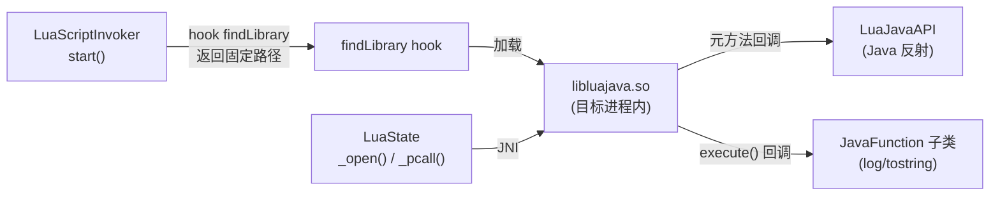

# 🌙 libluajava.so — Lua JNI 绑定库

`libluajava.so` 是 [Kepler Project](http://www.keplerproject.org/luajava/) luajava 的 native 组件，实现了 Lua 5.1 虚拟机与 JNI 的完整绑定，是 ZjDroid 在目标进程执行 Lua 脚本的 native 基础设施。

::: info so 无源码，基于 luajava 开源项目原理说明
`libluajava.so` 对应 luajava 开源项目的 C 实现。本文基于 luajava 公开原理说明，不涉及编造的具体 C 实现细节。
:::

## 🎯 职责

`libluajava.so` 主要承担三类工作：

| 职责 | 对应 Java 侧 |
|------|------------|
| Lua VM 生命周期管理 | `LuaState._open()` / `_close()` |
| Lua C API 的 JNI 包装 | `LuaState` 的全部 `private native` 方法 |
| Java 对象回调分发 | 调用 `LuaJavaAPI` 的静态方法 |

## 🧠 核心机制

### 1. Lua VM 的创建与注册

当 `LuaState._open()` 被调用时，native 层执行：

```
lua_State* L = luaL_newstate();   // 创建 Lua VM
// 将 stateId 注册到 Lua registry，供后续回调使用
return 创建 CPtr(L 的地址);
```

`luajava_open(cptr, stateId)` 进一步向 Lua 注册一系列元方法（`__index`、`__call`、`__newindex` 等），这些元方法在 Lua 访问 Java 对象时被触发，最终回调 `LuaJavaAPI` 的对应方法。

### 2. Java 对象在 Lua 中的表示

Lua 本身只有 nil/boolean/number/string/table/function/userdata/thread 八种类型。`libluajava.so` 将 Java 对象包装为 **Lua userdata**：

```
struct java_userdata {
    jobject jobj;    // Java 对象的全局引用
    int     type;    // 区分 JavaObject / JavaFunction / JavaArray
};
```

当 Lua 脚本访问 userdata 的字段（如 `javaObj.methodName`）时，触发 `__index` 元方法，native 层以 stateId 从 `LuaStateFactory` 取回 `LuaState`，再调用 `LuaJavaAPI.objectIndex(stateId, obj, methodName)`。

### 3. JavaFunction 的调用机制

`LuaState.pushJavaFunction(func)` 将 `JavaFunction` 实例包装为 userdata 并设置 `__call` 元方法。当 Lua 脚本调用该函数时：

```
Lua 侧: log("hello")
        ↓
native: __call 元方法触发
        ↓
JNI: (*env)->CallIntMethod(env, javaFuncObj, executeMethodID)
        ↓
Java: JavaFunction.execute() 被调用
```

### 4. 标准库的打开

`LuaState.openLibs()` → `_openLibs(cptr)` → `luaL_openlibs(L)`，一次性打开 Lua 的 base/table/io/os/string/math/debug/package 八个标准库。

## 🔗 与 ZjDroid 的关系



::: warning 目标进程加载的特殊性
`libluajava.so` 本身是 ZjDroid 模块的一部分，存放于 `/data/data/com.android.reverse/lib/libluajava.so`。在目标进程中，`System.loadLibrary("luajava")` 默认只搜索目标 App 自身的 lib 目录，因此必须通过 hook `findLibrary` 方法重定向路径。详见 [so 加载机制](/internals/native/so-loading)。
:::

## 📌 小结

`libluajava.so` 是 Lua VM 在 Android JVM 进程中运行的核心支撑，通过 JNI 将 Lua C API 完整暴露给 Java，并通过元方法机制实现双向调用。它的正确加载依赖 ZjDroid 的 `findLibrary` hook，是整个 Lua 注入能力链路上不可缺少的一环。

> 交叉参见：[so 加载机制](/internals/native/so-loading) · [LuaState](/internals/luajava/LuaState) · [CPtr](/internals/luajava/CPtr) · [架构：lua injection](/architecture/lua-injection)
