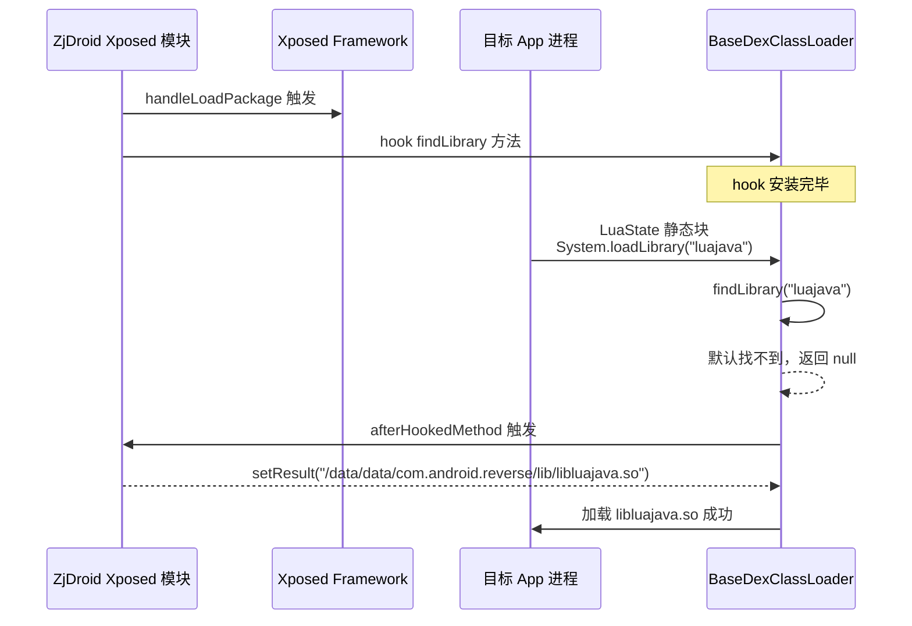
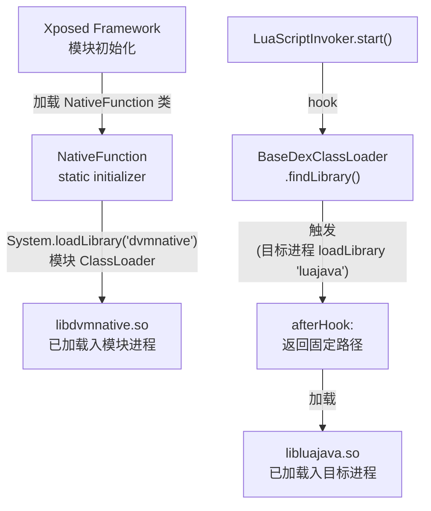

# 📦 so 加载机制 — 两个 so 如何进入目标进程

ZjDroid 的两个 so 库来自不同来源，进入目标进程的方式也截然不同。本章从源码出发，精确描述两个 so 的加载路径。

## 🎯 问题背景

在 Android 系统中，`System.loadLibrary(name)` 的解析顺序为：

```
ClassLoader.findLibrary(name)
  → BaseDexClassLoader.findLibrary
    → DexPathList.findLibrary
      → 遍历 nativeLibraryDirectories（只包含 App 自身的 lib 目录）
```

ZjDroid 的 so 文件存放在 **ZjDroid 模块自身的 lib 目录**（`/data/data/com.android.reverse/lib/`），而不在目标 App 的 lib 目录，因此目标进程正常情况下找不到它们。

## 🔧 libdvmnative.so 的加载

`libdvmnative.so` 由 `NativeFunction` 类的静态初始化块加载：

```java
// src/com/android/reverse/util/NativeFunction.java
static {
    System.loadLibrary(DVMNATIVE_LIB);  // "dvmnative"
}
```

**关键点**：`NativeFunction` 是 ZjDroid **Xposed 模块自身的类**，它在 Xposed Framework 早期初始化阶段被加载时，当前 ClassLoader 是 ZjDroid 模块的 ClassLoader，其 `findLibrary` 能正确找到模块 lib 目录下的 `libdvmnative.so`。

因此，`libdvmnative.so` **无需 hook**，由 Xposed 模块 ClassLoader 直接加载。

## 🔧 libluajava.so 的加载 — findLibrary Hook

`libluajava.so` 的加载由 `LuaScriptInvoker.start()` 负责：

```java
// src/com/android/reverse/collecter/LuaScriptInvoker.java
public void start() {
    Method findLibraryMethod = RefInvoke.findMethodExact(
        "dalvik.system.BaseDexClassLoader",
        ClassLoader.getSystemClassLoader(),
        "findLibrary",
        String.class
    );
    hookhelper.hookMethod(findLibraryMethod, new MethodHookCallBack() {
        @Override
        public void afterHookedMethod(HookParam param) {
            if (LUAJAVA_LIB.equals(param.args[0])   // 名称是 "luajava"
                    && param.getResult() == null) {   // 且默认找不到
                param.setResult(
                    "/data/data/com.android.reverse/lib/libluajava.so"
                );
            }
        }
    });
}
```

### Hook 时序



### 为什么是 `afterHookedMethod`？

Hook 在 `after` 阶段生效：先让原始 `findLibrary` 执行完（在目标 App lib 目录里找），如果返回 `null`（找不到）才介入替换。这样：
- 如果目标 App 自己也有 `libluajava.so`，不干扰；
- 只在找不到时才重定向，避免副作用。

## 📊 两个 so 加载路径对比

| | `libdvmnative.so` | `libluajava.so` |
|--|-------------------|-----------------|
| 加载位置 | ZjDroid 模块初始化时 | 目标进程中，按需（首次使用 LuaState 时） |
| ClassLoader | ZjDroid 模块 ClassLoader | 目标 App ClassLoader（hook 后） |
| 是否需要 hook | 不需要 | 需要 hook `findLibrary` |
| so 路径 | `/data/data/com.android.reverse/lib/libdvmnative.so` | `/data/data/com.android.reverse/lib/libluajava.so` |
| 加载触发点 | `NativeFunction` 类初始化 | `LuaState` 类初始化（`static { loadLibrary("luajava"); }`） |

## 🔗 关系



::: tip 调用 start() 的时机
`LuaScriptInvoker.start()` 应在目标进程的 `Application.onCreate` 之前（即 `handleLoadPackage` 阶段）调用，确保 hook 在目标 App 代码运行前生效。
:::

## 📌 小结

两个 so 的加载策略体现了 ZjDroid 对 Android ClassLoader 机制的深刻理解：`libdvmnative.so` 利用 Xposed 模块 ClassLoader 天然优势直接加载；`libluajava.so` 则通过 hook `findLibrary` 实现"路径重定向"，将模块自带的 so 注入目标进程。

> 交叉参见：[libdvmnative 原理](/internals/native/libdvmnative) · [libluajava 原理](/internals/native/libluajava) · [LuaScriptInvoker 源码](/source/collecter/LuaScriptInvoker) · [架构：lua injection](/architecture/lua-injection)
