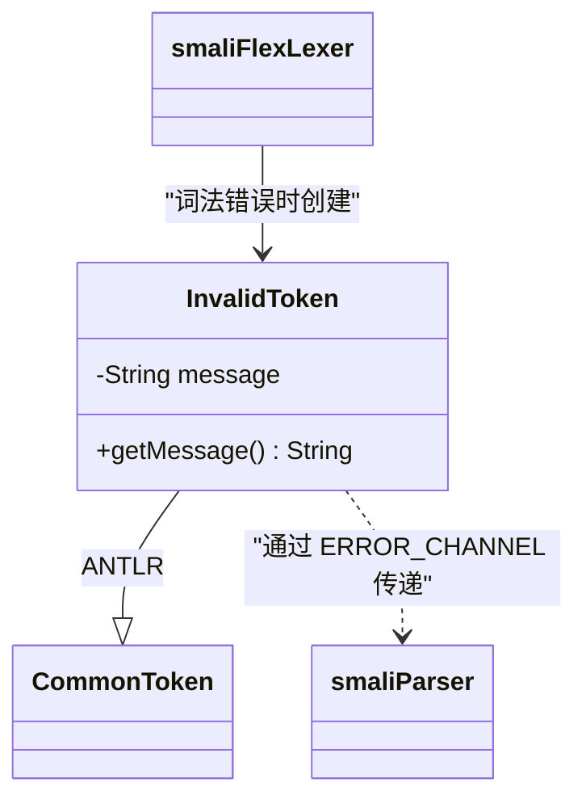

# 🔴 InvalidToken

> 词法分析失败时的 token 占位符，携带错误消息并通过专用错误频道传递给 parser。

| 属性 | 值 |
|---|---|
| 完整类名 | `org.jf.smali.InvalidToken` |
| 源码链接 | [InvalidToken.java](https://github.com/android-security-engineer/ZjDroid-skills/blob/master/src/org/jf/smali/InvalidToken.java) |
| 继承 | `CommonToken`（ANTLR） |

---

## 🎯 职责

当 `smaliFlexLexer` 遇到无法识别的字符序列时，不直接抛出异常，而是生成一个 `InvalidToken` 实例并将其放入 `ERROR_CHANNEL`：

1. **不中断 token 流**：后续 token 继续被正常扫描，parser 可以继续尝试分析
2. **携带错误消息**：`getMessage()` 返回描述错误的字符串
3. **独立错误频道**：使用 `smaliParser.ERROR_CHANNEL`，parser 默认忽略 hidden channel 中的 token，但错误统计仍会累加

---

## 🧠 关键实现

**完整类体**

```java
public class InvalidToken extends CommonToken {
    private final String message;

    public InvalidToken(String message) {
        super(smaliParser.INVALID_TOKEN);
        this.message = message;
        this.channel = smaliParser.ERROR_CHANNEL;
    }

    public InvalidToken(String message, String text) {
        super(smaliParser.INVALID_TOKEN, text);
        this.message = message;
        this.channel = smaliParser.ERROR_CHANNEL;
    }

    public String getMessage() {
        return message;
    }
}
```

token 类型固定为 `smaliParser.INVALID_TOKEN`（一个特殊的枚举值），频道固定为 `ERROR_CHANNEL`，使 parser 的主规则不会意外匹配到这个 token。

---

## 🔗 关系



---

## 📌 小结

`InvalidToken` 体现了"容错词法分析"的设计思想：词法错误不立即终止分析，而是生成占位 token 继续扫描，尽量收集更多错误信息（而不是第一个错误就停下来）。这与 `SemanticException` 通过 ANTLR 的 `reportError()` 机制累计错误的策略一脉相承，最终在 `assembleSmaliFile()` 中统一检查所有错误计数。
